# PROJECT_DOCUMENTATION

## 1. Project Overview

### Purpose of the application
DIYMate is a multi-app Django web platform for DIY project planning with AI assistance. Users can:
- Create and manage projects (title, description, dimensions, budget, optional image URL for premium users).
- Generate a structured AI plan (materials, steps, cost, safety).
- Generate AI inspiration ideas.
- Generate and save one technical drawing per project (Premium only).
- Manage subscription lifecycle through Stripe Checkout, Stripe Billing Portal, and Stripe webhooks.

### Overall architecture
- Presentation layer: Django templates in [templates](templates), [accounts/templates/accounts](accounts/templates/accounts), and [projects/templates/projects](projects/templates/projects).
- Application layer: function-based views in [accounts/views.py](accounts/views.py), [projects/views.py](projects/views.py), [planner/views.py](planner/views.py).
- Domain/business layer: service functions in [accounts/services.py](accounts/services.py), AI helpers in [planner/openai_client.py](planner/openai_client.py), prompts in [planner/ai_instructions.py](planner/ai_instructions.py).
- Data layer: Django ORM models in [accounts/models.py](accounts/models.py), [projects/models.py](projects/models.py), [planner/models.py](planner/models.py).
- Integration layer: Stripe SDK (billing) and OpenAI SDK (text/image generation).

### Django version
- settings/module header comments: generated by Django 4.2.30.
- requirements pin: Django==6.0.6 in [requirements.txt](requirements.txt).
- migrations include both 4.2.30 and 6.0.6 generator tags.

Conclusion: the codebase was created on 4.2.x and later upgraded to 6.0.x.

### Third-party packages actually used by this code

| Package | Purpose in project |
|---|---|
| Django | Core web framework |
| django-allauth | Login, signup, social providers (Google/GitHub), logout handling |
| stripe | Checkout sessions, billing portal, webhook verification |
| openai | AI text generation and drawing generation |
| dj-database-url | Parse DATABASE_URL to Django DATABASES |
| gunicorn | Production WSGI server (Procfile) |
| whitenoise | Static serving/compression/manifest storage |
| crispy-bootstrap5, django-crispy-forms | Installed for form rendering support |
| psycopg2 | PostgreSQL adapter |

### Design philosophy
- Clear app separation by domain:
	- accounts: identity, profile, subscription, billing.
	- projects: user project lifecycle.
	- planner: AI plan/drawing/inspiration generation.
- Keep generation explicit and user-triggered.
- Cache plan/inspiration once generated (reduce repeated AI calls).
- Enforce object ownership in all protected views (`user=request.user` filters).
- Keep Stripe synchronization robust via dual sync paths:
	- immediate sync after checkout success page.
	- webhook-driven eventual consistency.

### High-level architecture diagram

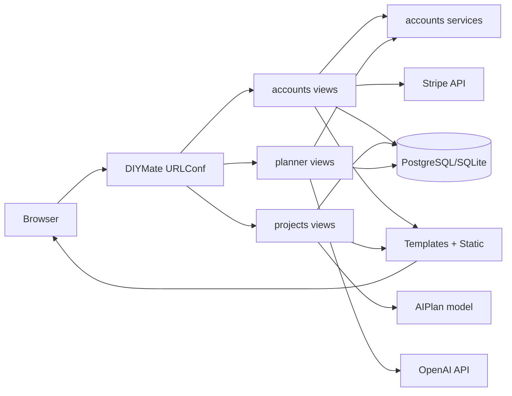

### Folder structure and top-level responsibilities

| Top-level folder/file | Responsibility |
|---|---|
| [DIYMate](DIYMate) | Global project config: settings, root URL routing, ASGI/WSGI entrypoints |
| [accounts](accounts) | Auth UI, profile, login audit events, subscriptions and Stripe billing |
| [projects](projects) | CRUD for projects and project detail page |
| [planner](planner) | AI generation endpoints and AIPlan persistence |
| [templates](templates) | Global templates (`base`, `home`, auth templates) |
| [static](static) | Source static assets authored for this project (CSS/JS/images/logo) |
| [staticfiles](staticfiles) | Collected static output for deployment (includes project assets + admin/allauth vendor assets) |
| [validations](validations) | Testing evidence artifacts (W3, lighthouse, mockups, screenshots, wireframes, ERD image) |
| [manage.py](manage.py) | Django CLI entrypoint |
| [env.py](env.py) | Local environment variable bootstrap (currently hardcoded secrets; security risk) |
| [requirements.txt](requirements.txt) | Dependency lock list |
| [Procfile](Procfile) | Deployment command for platform process manager |
| [db.sqlite3](db.sqlite3) | Local SQLite DB file |
| [README.md](README.md) | Product and setup narrative |
| [VALIDATIONS.md](VALIDATIONS.md) | Validation evidence index |
| [WIREFRAMES.md](WIREFRAMES.md) | Wireframe references |
| [BRAKEDOWN.md](BRAKEDOWN.md) | This full architecture/technical documentation |

---

## 2. Application Breakdown

## Accounts App

### Purpose
Handles identity-adjacent business concerns not covered by default Django auth pages:
- Custom login by username or email with remember-me session behavior.
- Registration extended with profile data.
- User profile view/edit.
- Login auditing via `LoginEvent`.
- Subscription state and Stripe lifecycle endpoints.

### Folder structure and file responsibilities

| File/folder | Role |
|---|---|
| [accounts/apps.py](accounts/apps.py) | AppConfig registration |
| [accounts/models.py](accounts/models.py) | `Profile`, `LoginEvent`, `Subscription` models |
| [accounts/forms.py](accounts/forms.py) | `LoginForm`, `RegisterForm`, `ProfileForm` |
| [accounts/services.py](accounts/services.py) | Reusable subscription/usage/Stripe payload sync logic |
| [accounts/views.py](accounts/views.py) | Home, auth endpoints, profile endpoints, billing endpoints, webhook |
| [accounts/urls.py](accounts/urls.py) | Accounts URL routes |
| [accounts/admin.py](accounts/admin.py) | Admin registration for Subscription/LoginEvent |
| [accounts/tests.py](accounts/tests.py) | Auth/billing/subscription behavior tests |
| [accounts/migrations](accounts/migrations) | Schema evolution for Subscription/Profile/LoginEvent |
| [accounts/templates/accounts](accounts/templates/accounts) | Profile/Billing/Profile edit templates |
| [accounts/__init__.py](accounts/__init__.py) | Python package marker |

### Models

#### Profile

```python
class Profile(models.Model):
		user = models.OneToOneField(settings.AUTH_USER_MODEL, on_delete=models.CASCADE, related_name='profile')
		phone_number = models.CharField(max_length=20, blank=True)
		address = models.CharField(max_length=255, blank=True)
```

Why each field exists:
- `user` (OneToOne): extend Django User without custom user model migration complexity.
- `phone_number`, `address`: contact fields captured during signup and editable later.

#### LoginEvent

```python
class LoginEvent(models.Model):
		user = models.ForeignKey(settings.AUTH_USER_MODEL, on_delete=models.SET_NULL, null=True, blank=True)
		attempted_identifier = models.CharField(max_length=254, blank=True)
		result = models.CharField(max_length=10, choices=RESULT_CHOICES)
		success = models.BooleanField(default=False)
		ip_address = models.GenericIPAddressField(blank=True, null=True)
		full_name_snapshot = models.CharField(max_length=150, blank=True)
		email_snapshot = models.EmailField(blank=True)
		phone_number_snapshot = models.CharField(max_length=20, blank=True)
		address_snapshot = models.CharField(max_length=255, blank=True)
		created_at = models.DateTimeField(auto_now_add=True)
```

Why each field exists:
- `attempted_identifier`: stores username/email attempted.
- `result` + `success`: dual status representation for query clarity.
- `ip_address`: lightweight audit signal.
- snapshot fields: immutable capture of user profile state at login time.
- `user` nullable: failed attempts may not map to a known account.

#### Subscription

```python
class Subscription(models.Model):
		user = models.OneToOneField(settings.AUTH_USER_MODEL, on_delete=models.CASCADE, related_name='subscription')
		plan = models.CharField(max_length=20, choices=PLAN_CHOICES, default=PLAN_FREE)
		is_active = models.BooleanField(default=False)
		ai_usage_count = models.IntegerField(default=0)
		stripe_customer_id = models.CharField(max_length=255, blank=True, null=True)
		stripe_subscription_id = models.CharField(max_length=255, blank=True, null=True)
		stripe_price_id = models.CharField(max_length=255, blank=True, null=True)
		renew_date = models.DateTimeField(blank=True, null=True)
		updated_at = models.DateTimeField(auto_now=True)
```

Why each field exists:
- `plan` and `is_active`: explicit business plan flag and active status.
- `ai_usage_count`: enforce free-tier AI limit.
- Stripe IDs: map internal account to external billing entities.
- `renew_date`: display next billing period end.
- custom `save()`: normalizes `is_active` from `plan` when manually edited.

### Accounts ER diagram

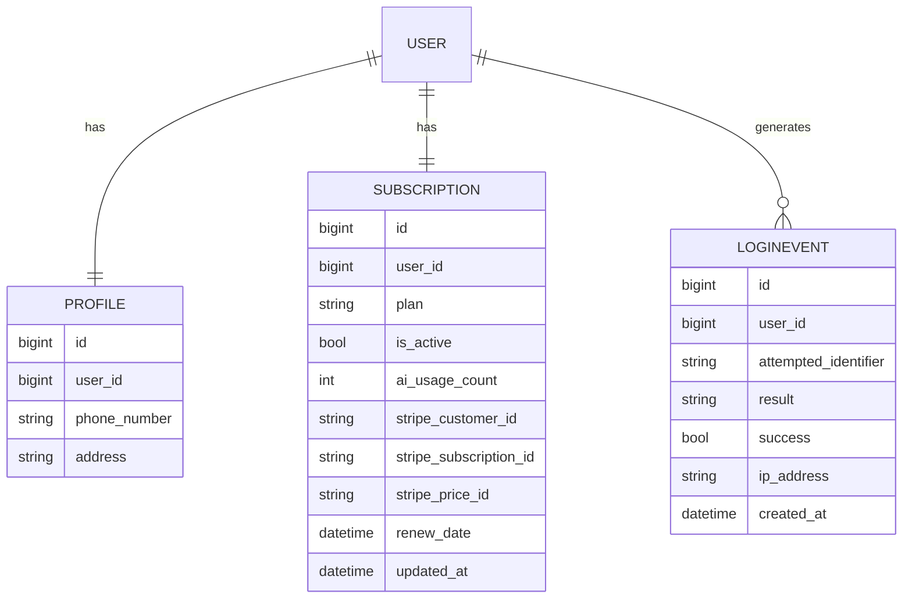

### Views

All views are function-based in [accounts/views.py](accounts/views.py).

#### `home_view`
Code snippet:
```python
def home_view(request):
		return render(request, 'home.html')
```
Line-by-line:
1. Accepts `HttpRequest`.
2. Renders global home template.

Workflow:
- GET `/` -> `home_view` -> `home.html` response.

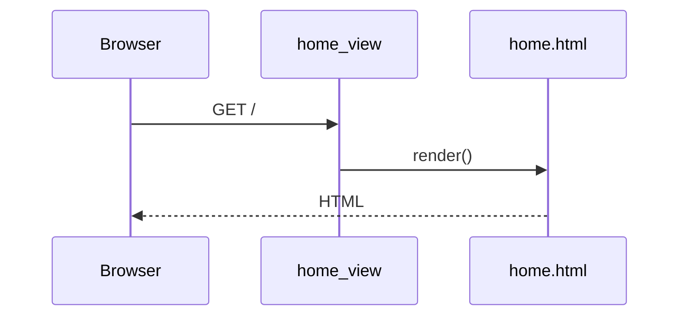

#### `login_view`
Code snippet (core path):
```python
if request.method == 'POST':
		form = LoginForm(request.POST)
		if form.is_valid():
				user = User.objects.filter(Q(username=identifier) | Q(email__iexact=identifier)).first()
				if user and user.check_password(password):
						login(request, user)
```

Line-by-line (core behavior):
1. POST branch validates form fields (`login`, `password`, `remember`).
2. Finds user by username OR case-insensitive email.
3. Uses `check_password` directly for authentication.
4. Records success/failure via `_record_login_event`.
5. Sets session expiry:
	 - remember true: 14 days (1209600 sec).
	 - remember false: browser session.
6. Redirects home on success; redisplays form with non-field error on failure.

Workflow:
- POST `/accounts/login/` -> validate form -> lookup user -> password check -> login -> session expiry -> redirect.

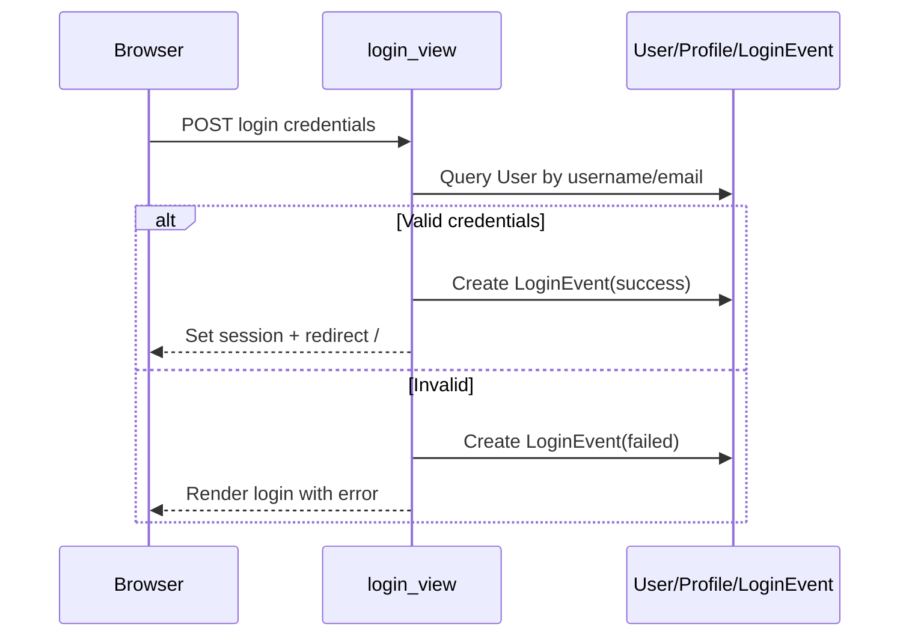

#### `signup_view`
Code snippet:
```python
form = RegisterForm(request.POST)
if form.is_valid():
		user = form.save()
		login(request, user)
```

Line-by-line:
1. Uses custom `RegisterForm` (extends `UserCreationForm`).
2. On save, creates User and `Profile` with phone/address.
3. Logs user in immediately.
4. Adds configured social providers list for UI.

Workflow:
- POST signup -> form clean (email uniqueness, password checks) -> User create -> Profile create -> login -> redirect home.

#### `profile_view`
- Decorated with `@login_required`.
- `Profile.objects.get_or_create(user=request.user)` ensures profile exists.
- `get_or_create_subscription` ensures subscription exists.
- Renders profile metrics including free AI limit and remaining generations.

#### `edit_profile_view`
- `@login_required`.
- Binds `ProfileForm` with `user=` to update both `User` and `Profile` in one save method.
- Redirects to `profile` on success.

#### Billing-related views

| View | Request | Key operations | Response |
|---|---|---|---|
| `billing_info_view` | GET | load/create subscription, compute pricing display | render billing template |
| `start_checkout_session` | POST | validate Stripe config, build line item, create Stripe customer/session | redirect Stripe Checkout URL |
| `billing_portal` | POST | create Stripe Billing Portal session | redirect Stripe portal URL |
| `subscription_success` | GET | optional sync from checkout session id | redirect profile + success message |
| `subscription_cancel` | GET | informational message only | redirect profile |
| `stripe_webhook` | POST | verify signature, process checkout/subscription events, sync/cancel local subscription | JSON ok |

Stripe webhook event handling in `stripe_webhook`:
- `checkout.session.completed`: map session metadata/client_reference to user, link customer/subscription, fetch Stripe subscription details.
- `customer.subscription.created|updated`: sync active status, plan, renewal date, stripe price.
- `customer.subscription.deleted`: mark local subscription canceled/free.

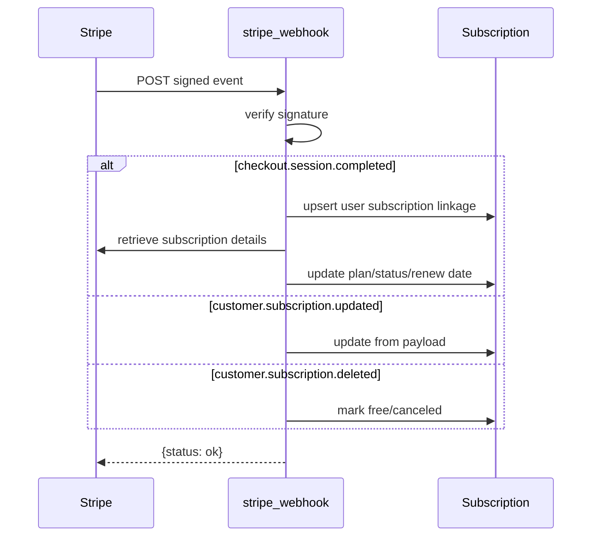

### Forms

| Form | Type | Validation and save behavior |
|---|---|---|
| `LoginForm` | `forms.Form` | plain field-level validation, remember-me boolean |
| `RegisterForm` | `UserCreationForm` | email uniqueness check, saves `first_name`/`last_name`, creates/updates `Profile` |
| `ProfileForm` | `ModelForm(Profile)` | accepts `user` in constructor, initializes `User` fields, save updates `User` then `Profile` |

### URLs

`accounts/` URL tree from [accounts/urls.py](accounts/urls.py):
- `/accounts/login/`
- `/accounts/signup/`
- `/accounts/profile/`
- `/accounts/profile/edit/`
- `/accounts/billing/`
- `/accounts/billing/checkout/`
- `/accounts/billing/portal/`
- `/accounts/billing/success/`
- `/accounts/billing/cancel/`
- `/accounts/billing/webhook/`

### Templates

| Template | Rendered by | Purpose | Main context |
|---|---|---|---|
| [accounts/templates/accounts/profile.html](accounts/templates/accounts/profile.html) | `profile_view` | User profile dashboard + billing actions | `profile`, `subscription`, limit metrics |
| [accounts/templates/accounts/edit_profile.html](accounts/templates/accounts/edit_profile.html) | `edit_profile_view` | Profile edit form | `form`, `profile` |
| [accounts/templates/accounts/billing_info.html](accounts/templates/accounts/billing_info.html) | `billing_info_view` | Plan comparison + checkout/portal actions | `subscription`, `pricing`, usage |

### Static files used by accounts views
- Accounts pages consume shared global CSS/JS loaded by [templates/base.html](templates/base.html).
- Login/signup templates use classes styled by [static/css/components/auth.css](static/css/components/auth.css).

### Services

Service functions in [accounts/services.py](accounts/services.py):

| Function | Inputs | Outputs | DB/external effects | Why in services |
|---|---|---|---|---|
| `get_or_create_subscription` | `user` | `Subscription` | `get_or_create` row | shared by multiple views/apps |
| `get_free_ai_limit` | none | int | reads settings | central config access |
| `consume_ai_generation_credit` | `user` | `(allowed, subscription, message)` | increments usage for free plan | keeps quota logic out of views |
| `remaining_free_generations` | `subscription` | int | pure computation | shared display logic |
| `update_subscription_from_stripe_payload` | local subscription + stripe payload dict | none | updates plan/status/renew/stripe IDs | central Stripe mapping |
| `mark_subscription_canceled` | `subscription` | none | resets plan/active/renew | reuse in webhook/event handlers |

### Signals
No custom signals module exists in `accounts`.

### Admin
- [accounts/admin.py](accounts/admin.py):
	- Registers `Subscription` with default admin.
	- Custom `LoginEventAdmin` with list display, filters, and searchable audit fields.

### Permissions/auth/session management
- Route protection: `@login_required` on profile/billing/protected endpoints.
- Login strategy: custom login uses user lookup + password check + Django `login()`.
- Session policy:
	- remember checked => 2-week persistent session.
	- unchecked => session expires at browser close.
- Authorization: object ownership mostly enforced in projects/planner with `user=request.user` filters.

### Database flow (accounts)

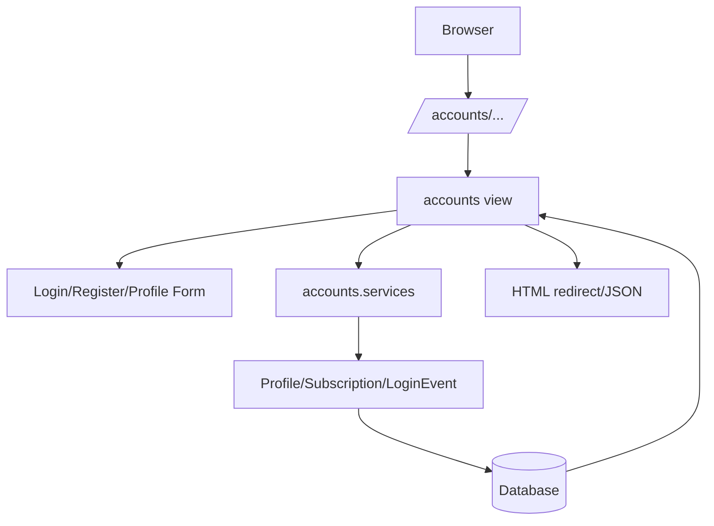

### Complete workflows (accounts)

#### User Registration Workflow
1. Browser posts signup form to `/accounts/signup/`.
2. `RegisterForm.clean_email()` checks uniqueness.
3. `RegisterForm.save()` creates User.
4. Same save call creates or updates Profile with phone/address.
5. View logs user in using Django session auth.
6. Browser receives redirect to `/`.

#### Login Workflow
1. Browser posts identifier/password/remember.
2. View resolves identifier against username or email.
3. Password checked via `user.check_password()`.
4. `LoginEvent` recorded with snapshots and IP.
5. Session expiry set according to remember flag.
6. Redirect home or redisplay errors.

#### Profile Update Workflow
1. Authenticated user requests `/accounts/profile/edit/`.
2. `ProfileForm` initialized with user and existing profile.
3. On submit, form saves User fields (`first_name`, `last_name`, `email`) and Profile fields (`phone_number`, `address`).
4. Redirect to profile page.

#### Subscription Purchase + Stripe Checkout + Webhook + Billing Portal
1. User posts `/accounts/billing/checkout/`.
2. App validates Stripe config and line item.
3. App ensures Stripe Customer exists.
4. Stripe Checkout Session created in subscription mode.
5. Browser redirected to Stripe hosted checkout.
6. Stripe returns to `/accounts/billing/success/?session_id=...`.
7. App attempts immediate sync by retrieving checkout session and subscription.
8. Independently, Stripe webhook posts event to `/accounts/billing/webhook/` and app upserts final subscription state.
9. User can post `/accounts/billing/portal/` to enter Stripe billing portal.

---

## Planner App

### Purpose
Encapsulates AI-specific planning capabilities:
- Create initial AI plan for a project.
- Generate inspiration ideas for existing plan.
- Generate one temporary technical drawing preview.
- Persist drawing as saved drawing for plan.

### Folder structure and file responsibilities

| File/folder | Role |
|---|---|
| [planner/apps.py](planner/apps.py) | Planner app config |
| [planner/models.py](planner/models.py) | `AIPlan` model |
| [planner/views.py](planner/views.py) | Generation endpoints and gating logic |
| [planner/openai_client.py](planner/openai_client.py) | Image generation API wrapper and data URL normalization |
| [planner/ai_instructions.py](planner/ai_instructions.py) | Central reusable AI system/user instruction strings |
| [planner/urls.py](planner/urls.py) | Route map for generation endpoints |
| [planner/admin.py](planner/admin.py) | currently no model registration |
| [planner/tests.py](planner/tests.py) | placeholder only |
| [planner/migrations](planner/migrations) | AIPlan schema evolution |
| [planner/__init__.py](planner/__init__.py) | package marker |

### Models

#### AIPlan

```python
class AIPlan(models.Model):
		project = models.ForeignKey(Project, on_delete=models.CASCADE, related_name='plans')
		materials = models.JSONField()
		steps = models.JSONField()
		cost = models.DecimalField(max_digits=10, decimal_places=2, null=True, blank=True)
		safety = models.TextField()
		generated_images = models.JSONField(blank=True, null=True)
		temporary_drawing_data = models.TextField(blank=True, null=True)
		temporary_drawing_prompt = models.TextField(blank=True, null=True)
		saved_drawing_data = models.TextField(blank=True, null=True)
		drawing_saved_at = models.DateTimeField(blank=True, null=True)
		created_at = models.DateTimeField(auto_now_add=True)
		updated_at = models.DateTimeField(auto_now=True)
```

Field rationale:
- `project`: links generated plan to project entity.
- JSON fields (`materials`, `steps`, `generated_images`) preserve structured AI output.
- `cost` decimal supports currency display/comparison.
- `temporary_drawing_*` fields support expiring preview behavior.
- `saved_drawing_data` + `drawing_saved_at` preserve user-confirmed output.

### Views

| View | Method | Authentication | Business rules |
|---|---|---|---|
| `generate_plan` | POST | required | one cached plan per project unless deleted; consumes free credit unless premium |
| `generate_plan_inspirations` | POST | required | requires existing plan; caches 3 ideas; consumes credit |
| `regenerate_plan_drawing` | POST | required | requires plan; premium only; max 1 drawing per project |
| `save_plan_drawing` | POST | required | requires temporary drawing; moves temp to saved |

Key request flow for `generate_plan`:
1. Validate POST and ownership (`Project` filtered by user).
2. Return cached plan if present (no new API call).
3. `consume_ai_generation_credit` enforces free-tier limits.
4. Build prompt and call OpenAI text API.
5. Parse JSON and normalize steps.
6. Persist AIPlan and redirect.

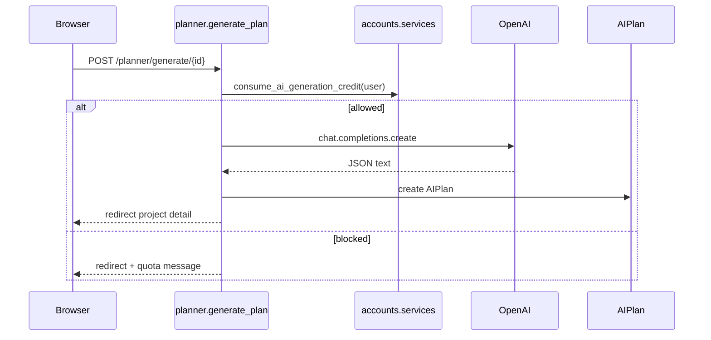

### Forms
No local forms module. Planner endpoints are action forms rendered in project detail template and handled directly in views.

### URLs
From [planner/urls.py](planner/urls.py):
- `/planner/generate/<project_id>/`
- `/planner/generate/<project_id>/inspirations/`
- `/planner/generate/<project_id>/drawing/regenerate/`
- `/planner/generate/<project_id>/drawing/save/`

### Templates
No dedicated planner template directory. Planner actions are embedded in [projects/templates/projects/project_detail.html](projects/templates/projects/project_detail.html).

### Static files
Planner UX states (loading modal, button disabling) are handled by [static/js/app.js](static/js/app.js).

### Services
- [planner/openai_client.py](planner/openai_client.py): wraps image generation and normalizes output into data URL or direct URL.
- [planner/ai_instructions.py](planner/ai_instructions.py): central prompt constants used in generation.

### Signals
No planner signals module exists.

### Admin
[planner/admin.py](planner/admin.py) currently contains no model registrations.

### Permissions
- All planner endpoints require login and enforce project ownership with `get_object_or_404(Project, id=..., user=request.user)`.

### Database flow (planner)

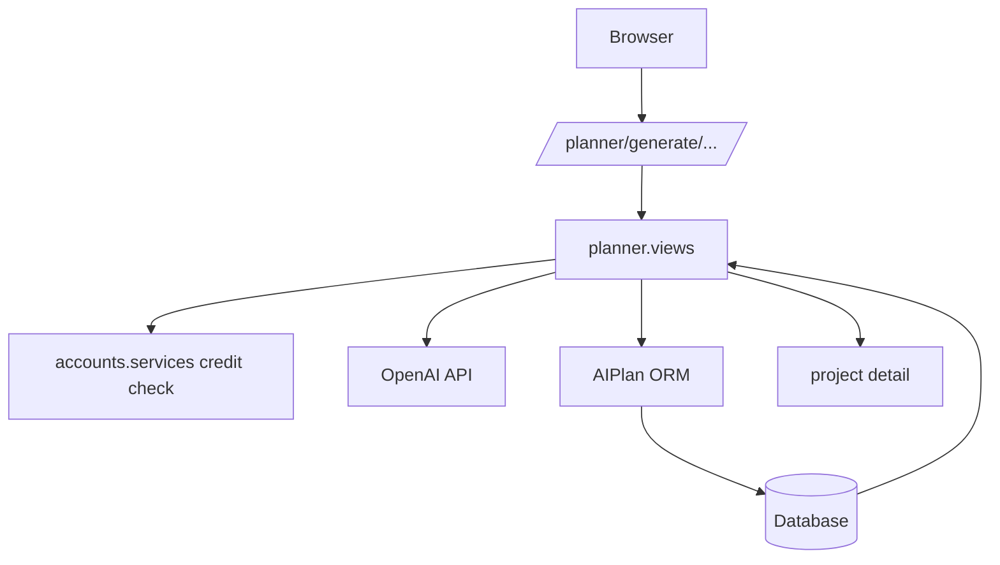

### Complete workflows (planner)

#### Create Project Plan / Generate AI Plan
1. User clicks Generate AI Plan on project detail.
2. POST to planner generate endpoint.
3. Existing plan check returns cached plan if present.
4. Free/premium quota check.
5. Prompt built from project context.
6. OpenAI response parsed as strict JSON.
7. AIPlan row inserted.
8. Redirect to project detail with success message.

#### Generate Inspiration Ideas
1. User posts inspiration endpoint.
2. View ensures AIPlan exists.
3. Reuses cached ideas if already present.
4. Consumes usage credit for free users.
5. Updates `generated_images` JSON.

#### Generate Drawing / Save Drawing
1. User posts drawing regenerate endpoint.
2. Premium and per-project single-image gate checked.
3. Image generated and stored in `temporary_drawing_data`.
4. User can save drawing -> moves temporary data to `saved_drawing_data`, clears temporary fields.

---

## Projects App

### Purpose
Implements user-owned project CRUD and project detail page that hosts planner actions and displays AI output.

### Folder structure and file responsibilities

| File/folder | Role |
|---|---|
| [projects/apps.py](projects/apps.py) | Projects app config |
| [projects/models.py](projects/models.py) | `Project` model |
| [projects/forms.py](projects/forms.py) | `ProjectForm` with premium/free field gating |
| [projects/views.py](projects/views.py) | create/list/detail/edit/delete |
| [projects/urls.py](projects/urls.py) | Projects URL map |
| [projects/admin.py](projects/admin.py) | Project admin registration |
| [projects/tests.py](projects/tests.py) | CRUD + planner integration tests |
| [projects/migrations](projects/migrations) | Project schema evolution |
| [projects/templates/projects](projects/templates/projects) | list/detail/create/edit/delete templates |
| [projects/__init__.py](projects/__init__.py) | package marker |

### Models

```python
class Project(models.Model):
		user = models.ForeignKey(settings.AUTH_USER_MODEL, on_delete=models.CASCADE)
		title = models.CharField(max_length=200)
		description = models.TextField()
		dimensions = models.CharField(max_length=100)
		budget = models.DecimalField(max_digits=10, decimal_places=2)
		image_url = models.URLField(blank=True, null=True)
		created_at = models.DateTimeField(auto_now_add=True)
		updated_at = models.DateTimeField(auto_now=True)

		class Meta:
				ordering = ['-created_at']
```

Field rationale:
- `user`: ownership boundary for authorization.
- `title/description/dimensions/budget`: baseline structured input for AI planning.
- `image_url`: optional reference image, shown only for premium in forms.
- timestamps support sorting and freshness display.

### Projects ER relationship

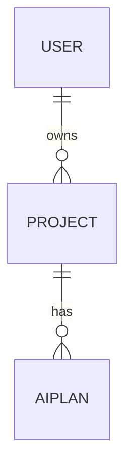

### Views

| View | Request | Auth | DB operations | Response |
|---|---|---|---|---|
| `create_project` | GET/POST | required | insert Project | render form or redirect detail |
| `project_list` | GET | required | select user projects | render list |
| `project_detail` | GET | required | select project + latest plan + prev/next nav neighbors | render detail |
| `edit_project` | GET/POST | required | update Project | render form or redirect detail |
| `delete_project` | GET/POST | required | delete Project | render confirm or redirect list |

Line-by-line explanation pattern (applies to all CRUD views):
1. Resolve object by id and authenticated owner.
2. Bind form for POST, validate, save.
3. Use messages framework for UX feedback.
4. Redirect on success to avoid duplicate form submissions.

`project_detail` execution notes:
- Loads latest plan via `project.plans.order_by('-created_at').first()`.
- Expires temporary drawings after 2 hours by clearing temporary fields.
- Computes previous/next project navigation in memory from user project list.

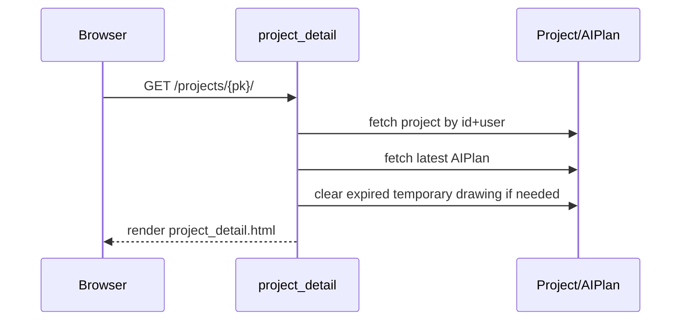

### Forms

`ProjectForm` in [projects/forms.py](projects/forms.py):
- `ModelForm` over `Project`.
- Constructor receives optional `user`.
- Reads subscription via `get_or_create_subscription(user)`.
- If plan is not premium, removes `image_url` field from form (`self.fields.pop('image_url', None)`).

This keeps view logic cleaner and centralizes premium feature gating at form level.

### URLs
From [projects/urls.py](projects/urls.py):
- `/projects/`
- `/projects/create/`
- `/projects/<pk>/`
- `/projects/<pk>/edit/`
- `/projects/<pk>/delete/`

### Templates

| Template | View | Details |
|---|---|---|
| [projects/templates/projects/project_list.html](projects/templates/projects/project_list.html) | `project_list` | project cards, latest plan preview, CRUD actions |
| [projects/templates/projects/project_detail.html](projects/templates/projects/project_detail.html) | `project_detail` | plan summary table, steps, inspirations, drawing actions |
| [projects/templates/projects/create_project.html](projects/templates/projects/create_project.html) | `create_project` | create form with `form.as_p` |
| [projects/templates/projects/edit_project.html](projects/templates/projects/edit_project.html) | `edit_project` | explicit field rendering and premium-only image_url block |
| [projects/templates/projects/delete_project.html](projects/templates/projects/delete_project.html) | `delete_project` | delete confirmation |
| [projects/templates/projects/delete.html](projects/templates/projects/delete.html) | legacy/unused duplicate delete template |

### Static files
- Uses shared static bundles loaded in base template.
- UI sections in detail/list page styled primarily by [static/css/components/pages.css](static/css/components/pages.css) and [static/css/components/forms.css](static/css/components/forms.css).

### Services
No `projects/services.py` exists. Business helper logic remains local or delegated to `accounts.services` and planner modules.

### Signals
No signals module exists.

### Admin
- [projects/admin.py](projects/admin.py) registers `Project` in Django admin.

### Permissions
- All views decorated with `@login_required`.
- All object retrievals include `user=request.user` where object-specific.

### Database flow (projects)

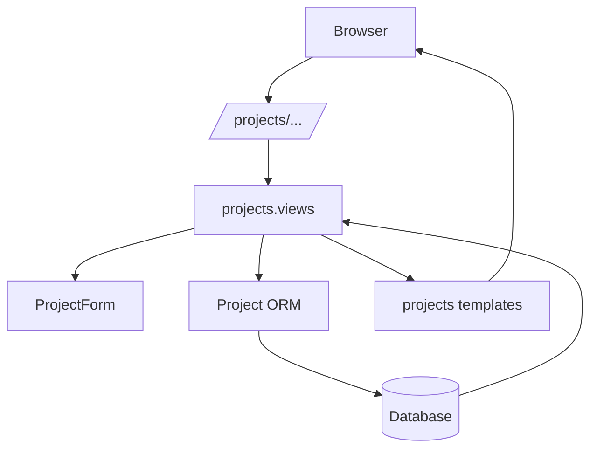

### Complete workflows (projects)

#### Create Project
1. User opens create page.
2. Form initialized with user, which may hide image_url for free plan.
3. Valid POST saves project with owner set server-side.
4. Redirect to project detail.

#### Edit Project
1. Owner-only object fetch.
2. POST validates and updates project.
3. AI plan regeneration remains manual and separate.

#### Delete Project
1. GET shows confirmation.
2. POST deletes project.
3. Redirect to list.

---

## 3. Cross-App Relationships

### Inter-app dependency graph

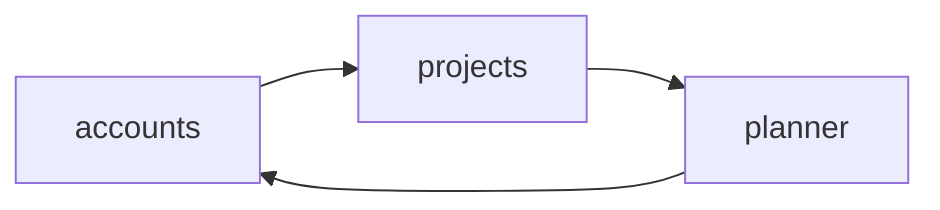

Explanation:
- `projects.forms.ProjectForm` imports `accounts.services.get_or_create_subscription` to gate premium fields.
- `planner.views` imports `accounts.services.consume_ai_generation_credit` for quota enforcement.
- `planner.models.AIPlan` references `projects.models.Project`.
- `accounts` and `projects` both depend on Django User model.

### Shared models and keys
- Shared auth principal: `settings.AUTH_USER_MODEL`.
- `Project.user` -> User (FK).
- `AIPlan.project` -> Project (FK).
- `Subscription.user` and `Profile.user` -> User (OneToOne).

### Circular import avoidance
- `accounts.services` contains pure business functions and only imports `Subscription`, minimizing dependency loops.
- Planner references accounts service functions rather than importing accounts views/forms.
- Projects references accounts service only inside form logic.

---

## 4. Authentication System

### Components
- Django auth model and session middleware.
- allauth endpoints included via root URLConf.
- Custom login/signup views in accounts app.

### Session and cookies
- Session backend via Django sessions middleware.
- Remember-me implemented through `request.session.set_expiry`.

### Login/logout
- Login route: `/accounts/login/` handled by custom `login_view`.
- Logout route available via allauth include (`account_logout`) and linked in nav.
- `ACCOUNT_LOGOUT_ON_GET = True` in settings.

### Social login
- Google and GitHub providers enabled in `INSTALLED_APPS` and `SOCIALACCOUNT_PROVIDERS`.
- Signup template conditionally shows provider buttons only if SocialApp entries exist.

### Profile and authorization
- Profile data split into `Profile` model.
- Authorization boundary in app views by checking owner fields.

### Middleware involved
- `SecurityMiddleware`
- `WhiteNoiseMiddleware`
- `SessionMiddleware`
- `CommonMiddleware`
- `CsrfViewMiddleware`
- `AuthenticationMiddleware`
- `MessageMiddleware`
- `XFrameOptionsMiddleware`
- `allauth.account.middleware.AccountMiddleware`

### Security considerations
- CSRF used for all form submissions except webhook (explicitly `@csrf_exempt`, as expected for Stripe).
- Webhook signature verification is implemented.
- Password hashes managed by Django auth.
- Critical issue: plaintext secrets in [env.py](env.py).

---

## 5. Stripe Integration

### Configuration
Settings keys used:
- `STRIPE_SECRET_KEY`
- `STRIPE_PUBLISHABLE_KEY`
- `STRIPE_WEBHOOK_SECRET`
- `STRIPE_PRICE_ID_PREMIUM`
- `STRIPE_CURRENCY`
- `STRIPE_PREMIUM_INTERVAL`

### Checkout session flow

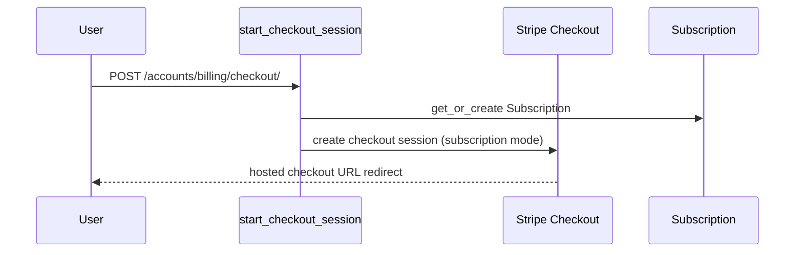

### Customer and subscription synchronization
- Customer creation occurs on-demand if no `stripe_customer_id` exists.
- Success page performs immediate sync from `session_id` query parameter.
- Webhook ensures eventual sync and handles subscription updates/deletions.

### Billing portal
- POST `/accounts/billing/portal/` creates Stripe billing portal session using stored customer id.

### Plan model and free/premium behavior
- Free plan: AI usage capped by `FREE_AI_USAGE_LIMIT`.
- Premium plan: unlimited text generations.
- Premium drawing policy: one image per project.

### Webhook verification and security
- Verifies with Stripe signature header and endpoint secret.
- Rejects invalid signature/payload with HTTP 400.

---

## 6. Database Design

### Full ER diagram

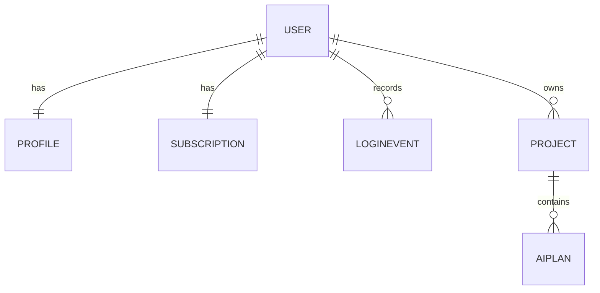

### Relationship explanation
- One user has exactly one profile and one subscription row (created lazily with get_or_create).
- One user has many projects.
- One project can have many AI plans over time (current app logic typically keeps latest one via cache behavior).
- Login events are append-only audit records.

---

## 7. Request Lifecycle

### End-to-end request path
1. Browser sends HTTP request.
2. Django middleware chain executes (security/session/csrf/auth/messages).
3. Root URL resolver in [DIYMate/urls.py](DIYMate/urls.py) dispatches to app URLConf.
4. App view executes:
	 - optional form validation
	 - service calls
	 - ORM queries/updates
	 - external API calls (Stripe/OpenAI) when needed
5. View returns render/redirect/JSON response.
6. Template engine renders HTML if `render()` used.
7. Static assets served via WhiteNoise in production.

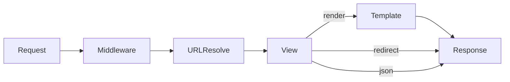

---

## 8. Django Internals Used

| Django feature | Where used | How it is used |
|---|---|---|
| `render()` | all apps | HTML response rendering |
| `redirect()` | all apps | PRG pattern after POST |
| `reverse()` | accounts billing | builds callback URLs for Stripe session |
| `ModelForm` | profiles/projects | model-backed form handling |
| `forms.Form` | login | non-model input validation |
| `QuerySet` filtering | all apps | ownership checks and lookups |
| `get_object_or_404` | projects/planner | object fetch + 404 on not found/not owned |
| decorators (`@login_required`) | accounts/projects/planner | route protection |
| Messages framework | accounts/projects/planner | user feedback banners |
| Sessions | login view | remember-me expiry control |
| CSRF middleware/tokens | all form templates | anti-CSRF protection |
| Template inheritance | `base.html` + child templates | shared shell/nav/messages/footer |
| ORM migrations | all apps | schema versioning |
| Admin site | accounts/projects | operational data inspection |

---

## 9. Code Quality Review

### Good design choices
- Strong domain split across apps.
- Ownership filtering on object access prevents cross-user data leaks.
- Reusable subscription/credit logic in services.
- Webhook verification implemented correctly.
- Cached generation behavior reduces repeated AI costs.
- Meaningful automated tests in accounts/projects.

### Potential improvements
- Remove secrets from [env.py](env.py) and rotate all exposed credentials immediately.
- Add planner test coverage (currently placeholder [planner/tests.py](planner/tests.py)).
- Consolidate duplicate AI utility functions (`normalize_steps`, prompt builders) between projects and planner modules.
- Remove or clearly deprecate unused legacy template [projects/templates/projects/delete.html](projects/templates/projects/delete.html).
- Standardize on one Django major version and regenerate comments/migrations consistency notes.

### Performance considerations
- Project detail loads all user projects for prev/next calculation; consider optimized query by created_at/id neighbors for large datasets.
- AI responses are not cached at infrastructure layer; app-level cached behavior exists only per project record.

### Security considerations
- Critical: repository contains plaintext DB/OpenAI/Stripe secrets in [env.py](env.py).
- `DEBUG=False` hardcoded can hinder local debug ergonomics; consider environment-driven DEBUG.
- Webhook endpoint is CSRF-exempt by necessity and protected by signature verification.

### Scalability
- Current architecture can scale moderately with DB-backed session state and stateless web nodes.
- Additional queuing (Celery/RQ) recommended for long AI requests at scale.

### Maintainability
- App boundaries are clear.
- Service extraction is partial and should be expanded (planner/business logic could be service-layered).
- Add docstrings to all view functions for long-term maintainability.

### Refactoring opportunities
1. Extract shared AI helper functions to one planner service module.
2. Convert repeated Stripe config validation to dedicated billing service class.
3. Add typed dataclasses/pydantic schema for AI response validation.
4. Consider class-based views for repetitive CRUD patterns if team prefers CBV conventions.

---

## 10. Appendix

### Complete folder tree (source-focused)

```text
DIYMate-Project+Stripe/
	DIYMate/
		__init__.py
		asgi.py
		settings.py
		urls.py
		wsgi.py
	accounts/
		__init__.py
		admin.py
		apps.py
		forms.py
		models.py
		services.py
		tests.py
		urls.py
		views.py
		migrations/
			0001_initial.py
			0002_rename_billing_id_subscription_stripe_customer_id_and_more.py
			0003_profile.py
			0004_subscription_plan_and_stripe_fields.py
			0005_loginevent.py
			__init__.py
		templates/accounts/
			billing_info.html
			edit_profile.html
			profile.html
	planner/
		__init__.py
		admin.py
		ai_instructions.py
		apps.py
		models.py
		openai_client.py
		tests.py
		urls.py
		views.py
		migrations/
			0001_initial.py
			0002_alter_aiplan_generated_images_alter_aiplan_project.py
			0003_aiplan_drawing_fields.py
			__init__.py
	projects/
		__init__.py
		admin.py
		apps.py
		forms.py
		models.py
		tests.py
		urls.py
		views.py
		migrations/
			0001_initial.py
			0002_alter_project_options_project_updated_at.py
			__init__.py
		templates/projects/
			create_project.html
			delete.html
			delete_project.html
			edit_project.html
			project_detail.html
			project_list.html
	templates/
		base.html
		home.html
		account/
			login.html
			signup.html
	static/
		css/components/
			auth.css
			core.css
			forms.css
			pages.css
		js/
			app.js
		images/
		logo_and_favicon/
	staticfiles/
		staticfiles.json
		css/, js/, images/, logo_and_favicon/
		admin/** (Django admin vendor collected files)
		account/js/account.js, onload.js (allauth collected files)
	validations/
		Entity-Relationship-Diagram(EPR)/
		lighthouse/
		mockups/
		screenshots/
		w3_validator/
		wireFrames/
	manage.py
	env.py
	Procfile
	requirements.txt
	db.sqlite3
	README.md
	VALIDATIONS.md
	WIREFRAMES.md
	BRAKEDOWN.md
```

### Important code snippets

Subscription quota gate:
```python
allowed, subscription, message = consume_ai_generation_credit(request.user)
if not allowed:
		messages.error(request, message)
		return redirect('project_detail', pk=project.id)
```

Object-level authorization pattern:
```python
project = get_object_or_404(Project, id=pk, user=request.user)
```

Stripe webhook verification:
```python
event = stripe.Webhook.construct_event(payload, signature, endpoint_secret)
```

### Glossary
- AIPlan: stored AI-generated plan and drawing metadata.
- Temporary drawing: preview image not yet user-confirmed.
- Saved drawing: user-confirmed persisted drawing on AIPlan.
- Free AI limit: max generation count for free plan users.
- Stripe Checkout Session: hosted payment flow object.
- Billing Portal: Stripe-hosted subscription management UI.

### Architecture summary
DIYMate is a server-rendered Django monolith with domain-partitioned apps, relational persistence, external AI/Stripe integrations, and strict user ownership checks at view level.

### Additional sequence diagram: Full user planning journey

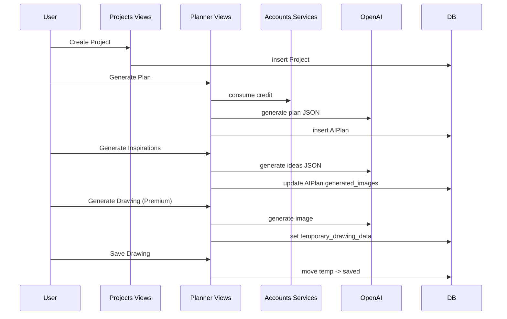

### Notes on generated/static/vendor files
- [staticfiles/admin](staticfiles/admin) contains Django admin distributed assets plus hashed duplicates from collectstatic.
- [staticfiles/account/js](staticfiles/account/js) contains django-allauth frontend helpers.
- [staticfiles/staticfiles.json](staticfiles/staticfiles.json) is WhiteNoise manifest mapping source static names to hashed output names.

These are deployment artifacts and are not primary application business logic, but they are part of runtime static delivery.
