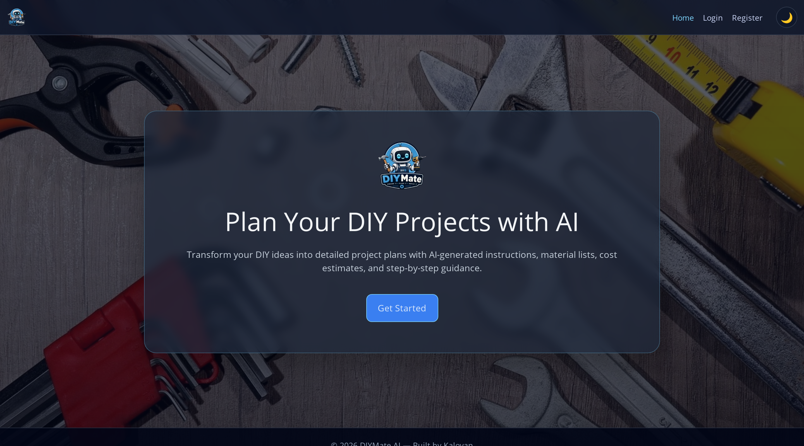
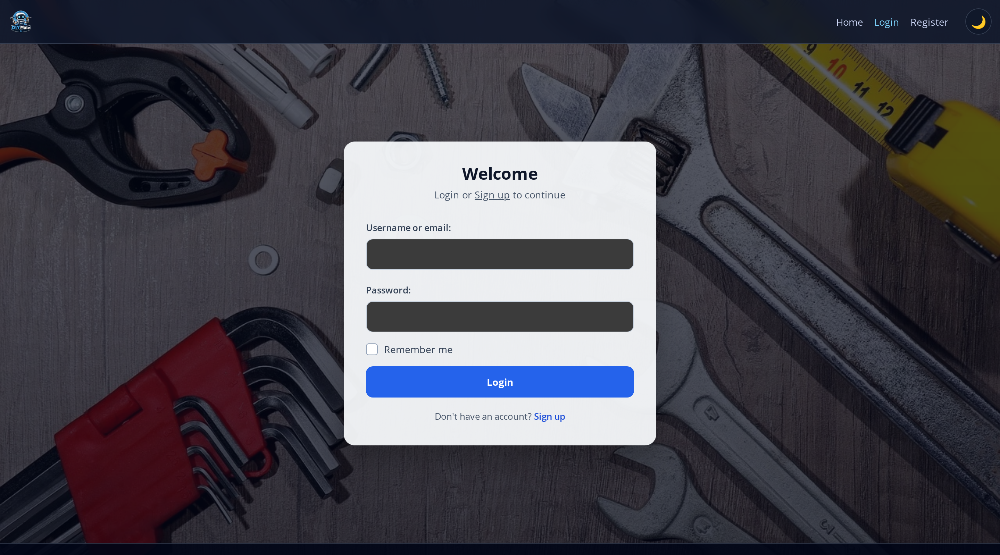
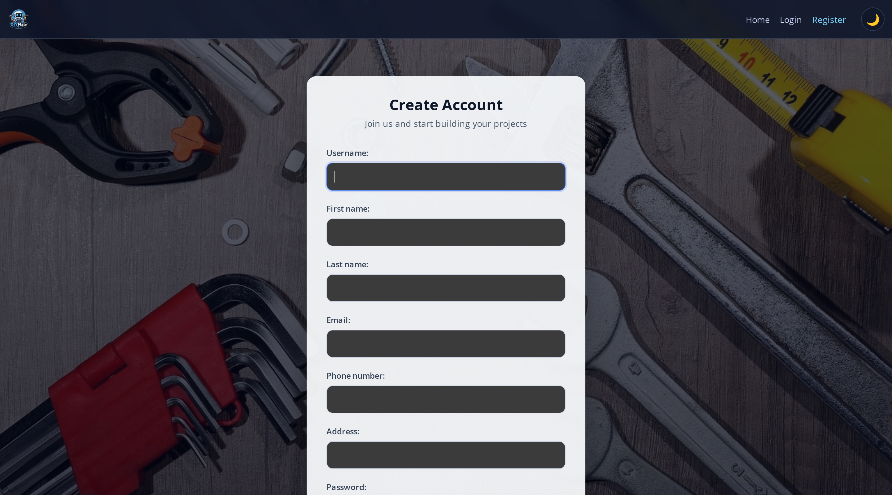
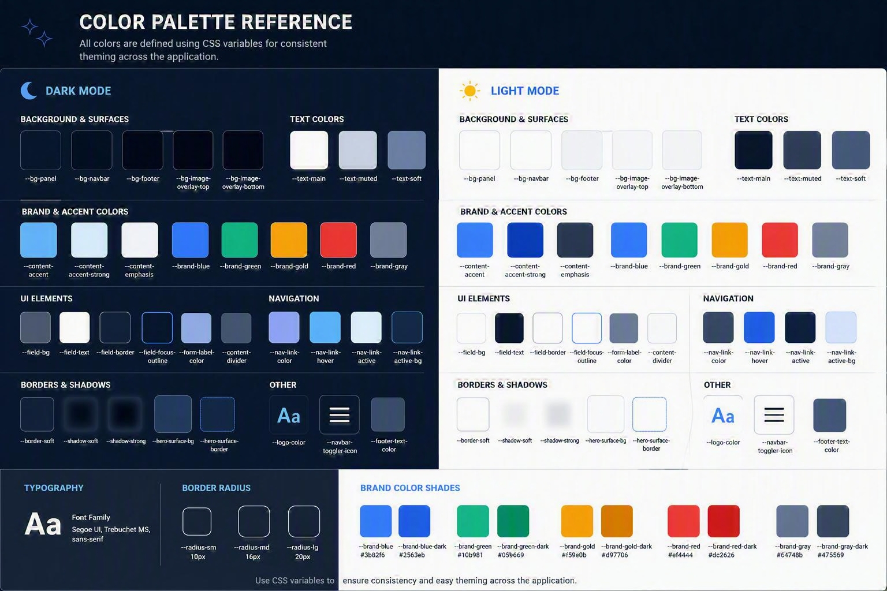

# DIYMate

Deployed App Link: [LINK](https://diy-mate-94e4f9025a67.herokuapp.com/)

## Table of Contents

- [Mockups](#mockups)
- [Color palets] (#color-palets)
- [Project Overview](#project-overview)
- [Project Updates](#project-updates)
- [Goals & Objectives](#goals--objectives)
- [Target Audience](#target-audience)
- [User Goals](#user-goals)
- [User Experience (UX)](#user-experience-ux)
- [User Stories](#user-stories)
- [Site Structure](#site-structure)
- [Design Decisions](#design-decisions)
- [Pages Overview](#pages-overview)
- [Key Features](#key-features)
- [Technology Stack](#technology-stack)
- [Architecture and Modules](#architecture-and-modules)
- [Installation and Local Setup](#installation-and-local-setup)
- [Environment Variables](#environment-variables)
- [User Flow](#user-flow)
- [Plan and Limit Model](#plan-and-limit-model)
- [AI Usage Declaration](#ai-usage-declaration)
- [Testing & Validation](#testing--validation)
- [Deployment](#deployment)
- [Security](#security)
- [Limitations](#limitations)
- [Future Improvements](#future-improvements)
- [Screenshots](#screenshots)
- [Figma Designs & Wireframes](#figma-designs--wireframes)
- [VALIDATIONS.md](VALIDATIONS.md)

## Mockups

This project was designed as a practical assistant for DIY planning, with a focus on clear actions and minimal friction.

- Core concept: convert a user project brief into a structured build plan.
- Visual style: clean, card-based interface with prominent project actions.
- Navigation principle: users should always be one click away from project list, profile, and billing.

Mockup placeholders :

- Home page mockup: 
- Login page mockup: 
- Regiter page mockup: 

## Color palets

- Color palets: 

## Project Overview

DIYMate is a Django web application that helps users plan DIY projects with AI support.

Users can:

- Create and manage personal DIY projects.
- Generate AI plan summaries with materials, cost, safety guidance, and step-by-step actions.
- Generate optional inspiration ideas.
- Generate one technical drawing per project on Premium.
- Upgrade to Premium through Stripe checkout and manage billing via Stripe Portal.

## Project Updates

Major implementation updates in the current version:

- Added custom authentication flow with login event tracking.
- Added profile management and subscription state per user.
- Added AI plan generation with cached plan behavior.
- Added on-demand inspiration generation and technical drawing workflow.
- Added Free vs Premium usage enforcement.
- Added Stripe checkout, success sync, billing portal access, and webhook handling.
- Added dark/light theme toggle and responsive layout improvements.

## Goals & Objectives

Primary goals:

- Reduce planning time for DIY users.
- Provide actionable and concise build instructions.
- Keep free tier useful while offering clear Premium value.
- Keep user data private through strict per-user project access control.

Secondary goals:

- Maintain modular Django app architecture.
- Keep deployment simple on Heroku-compatible infrastructure.

## Target Audience

DIYMate is aimed at:

- DIY beginners who need structured guidance.
- Hobby makers who want faster planning and cost awareness.
- Home improvers comparing ideas before purchase/build.
- Users comfortable with web apps who want optional AI assistance.

## User Goals

Typical user goals:

- Turn a rough project idea into a clear execution plan.
- Get a realistic materials checklist and estimated cost.
- Review concise safety guidance before building.
- Save and revisit plans for multiple projects.
- Upgrade for unlimited AI usage and technical drawing generation.

## User Experience (UX)

UX principles used in this build:

- Action-first pages: key actions appear near the top of each view.
- Progressive disclosure: collapsible sections keep dense AI output readable.
- Predictable navigation: persistent header with Home, Projects, Profile, Billing.
- Feedback-driven interface: Django messages for success, warnings, and errors.
- Accessibility-aware basics: semantic sections, aria labels, focus-aware controls.
- Theme preference support: dark/light toggle with persistent local preference.

## User Stories

Implemented user stories:

- As a visitor, I can sign up and log in with username or email.
- As a user, I can create, edit, and delete my own projects.
- As a user, I can generate an AI plan from project details.
- As a user, I can generate optional inspirations for an existing plan.
- As a Premium user, I can generate and save one technical drawing per project.
- As a Free user, I can use AI up to the configured free limit.
- As a user, I can review and manage billing from my account area.

## Site Structure

High-level route map:

- /: Home
- /accounts/login, /accounts/signup
- /accounts/profile, /accounts/profile/edit
- /accounts/billing and Stripe billing actions
- /projects: list
- /projects/create
- /projects/<id>: detail
- /projects/<id>/edit and /projects/<id>/delete
- /planner/generate/<project_id> and related generation endpoints

## Design Decisions

Key design decisions:

- Split domain logic into apps: accounts, projects, planner.
- Keep AI generation explicit and on-demand rather than automatic on each edit.
- Cache generated plan/inspirations to avoid unnecessary repeated token usage.
- Use OneToOne subscription model for clear per-user plan state.
- Keep temporary drawing data separate from saved drawing data.
- Use Stripe webhooks plus success-page sync for robust subscription updates.

## Pages Overview

Implemented pages:

- Home: landing page and CTA to get started.
- Login/Signup: account entry with social provider support configuration.
- Profile: personal details and subscription usage overview.
- Billing: free vs premium comparison, upgrade, portal management.
- Project List: all user projects with latest plan preview context.
- Create/Edit/Delete Project: full CRUD flow.
- Project Detail: AI plan summary, detailed steps, inspirations, drawing actions.

## Key Features

Core features:

- Account registration/login and social auth provider support.
- Login event tracking with snapshot metadata.
- Project CRUD with ownership protection.
- AI plan generation with structured JSON parsing and normalized steps.
- Inspiration idea generation.
- Technical drawing generation workflow with save/download.
- Free plan usage limit and Premium unlimited text generation.
- Premium drawing gate: one generated image per project.
- Stripe checkout, billing portal, and webhook-driven subscription sync.
- Responsive UI and theme toggling.

## Technology Stack

Backend and framework:

- Python
- Django 4.2
- django-allauth
- Stripe Python SDK
- OpenAI Python SDK

Infrastructure and deployment:

- Heroku-compatible deployment flow
- dj-database-url
- WhiteNoise for static file serving

Frontend:

- Django templates
- Bootstrap 5
- Custom CSS and vanilla JavaScript

## Architecture and Modules

Module responsibilities:

- accounts: authentication, profile data, login events, subscription/billing endpoints.
- projects: project lifecycle and main project pages.
- planner: AI generation endpoints and AI plan persistence.
- DIYMate: global settings, root URLs, and deployment configuration.

Data model overview:

- Project belongs to a user.
- AIPlan belongs to a project and stores plan outputs and drawing data.
- Profile belongs to a user.
- Subscription belongs to a user and tracks plan, usage, and Stripe IDs.
- LoginEvent logs authentication attempts for audit context.

- ERD /Entity-Relationship_Diagram.png)

## Installation and Local Setup

```bash
git clone https://github.com/KaloyanJK/DIYMate.git
cd DIYMate-Project+Stripe
python -m venv .venv
# Windows PowerShell
.venv\Scripts\Activate.ps1
pip install -r requirements.txt
python manage.py migrate
python manage.py runserver
```

Open http://127.0.0.1:8000/ in your browser.

## Environment Variables

Create environment variables before running locally or deploying.

Required or commonly used variables:

- SECRET_KEY
- DATABASE_URL
- OPENAI_API_KEY
- FREE_AI_USAGE_LIMIT
- STRIPE_SECRET_KEY
- STRIPE_PUBLISHABLE_KEY
- STRIPE_WEBHOOK_SECRET
- STRIPE_PRICE_ID_PREMIUM
- STRIPE_CURRENCY (default: gbp)
- STRIPE_PREMIUM_INTERVAL (default: month)

Optional for local workflow:

- env.py can be used locally if present.

## User Flow

Typical user journey:

1. User signs up or logs in.
2. User creates a new project with title, description, dimensions, and budget.
3. User opens project detail and generates AI plan.
4. User optionally generates inspirations.
5. Premium user can generate drawing and save/download it.
6. User edits project details and manages projects over time.
7. User checks profile and billing to monitor plan and usage.

## Plan and Limit Model

Implemented plan model:

- Free plan: limited AI generations controlled by FREE_AI_USAGE_LIMIT.
- Free plan: AI usage count increments on eligible generation actions.
- Premium plan: unlimited AI text generations.
- Premium plan: drawing generation enabled.
- Premium plan: one image generation allowed per project.

Billing state is synchronized from Stripe events and checkout/session sync logic.

## AI Usage Declaration

DIYMate uses AI (Microsoft copilot) for planning assistance and optional design assets.

- Text generation: project plans, material suggestions, concise step lists, safety notes, and inspiration ideas.
- Image generation: technical blueprint-style drawing previews.
- Model calls are initiated by user actions only.
- AI output can be incorrect or incomplete and must be validated by the user before real-world building.
- Logo generation

## Testing & Validation

Validation details and screenshots will be maintained in [VALIDATIONS.md](VALIDATIONS.md).

Current automated test coverage includes:

- Authentication and signup/login workflows.
- Billing checkout behavior and subscription synchronization.
- Project CRUD and project detail rendering with AI data.
- Free/Premium usage behavior in key generation paths.

Run tests locally:

```bash
python manage.py test
```

## Deployment

Deployment summary:

- Procfile-based process startup is configured.
- Static files are collected and served via WhiteNoise.
- Environment variables must be set on the hosting platform.
- Stripe webhook endpoint should point to /accounts/billing/webhook/.

## Security

Implemented security controls:

- CSRF protection on form endpoints.
- Authentication gates via login_required on user-protected views.
- Object-level ownership checks on project and plan access.
- Stripe webhook signature verification before processing events.
- Password hashing handled by Django authentication framework.
- Security middleware and clickjacking protections enabled in Django stack.

Operational recommendations:

- Set DEBUG=False in production.
- Rotate API keys and webhook secrets regularly.
- Use strong SECRET_KEY and protected environment variable storage.

## Limitations

Current limitations:

- AI outputs are not guaranteed accurate for all real build scenarios.
- No native PDF/CSV export for full reports yet.
- Planner tests are still minimal compared to accounts/projects coverage.
- Free usage counters are global per user, not segmented by generation type.
- Premium drawing allowance is one image per project in current logic.

## Future Improvements

Planned improvements:

- Add export options for plans and summaries (PDF/CSV).
- Expand automated tests for planner and webhook edge cases.
- Add richer analytics and reporting dashboard for user activity.
- Improve AI response validation and structured fallback handling.
- Add multi-image history for Premium projects.
- Add stronger observability around AI failures and retries.

## Screenshots

Leave image links empty for now and fill later:

- Home Page: 
- Project List: 
- Project Detail: 
- Profile: 
- Billing: 

## Wireframes

- Wireframes images in [WIREFRAMES.md](WIREFRAMES.md).
