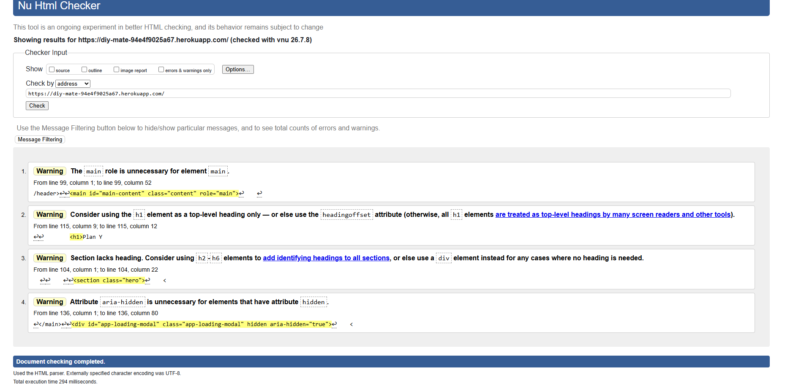
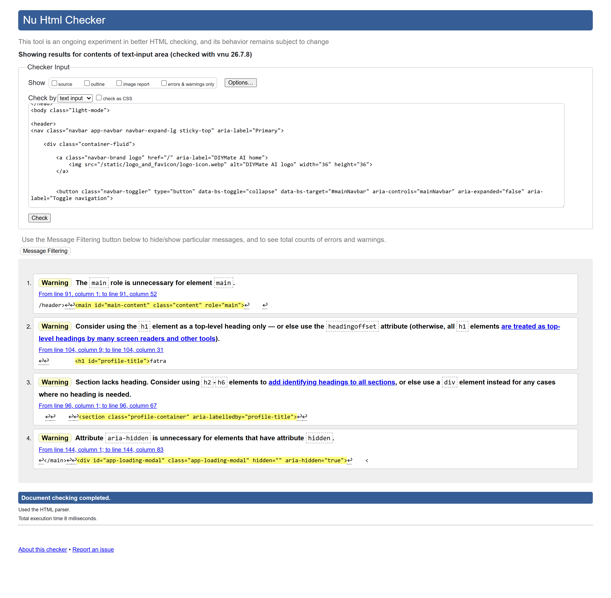
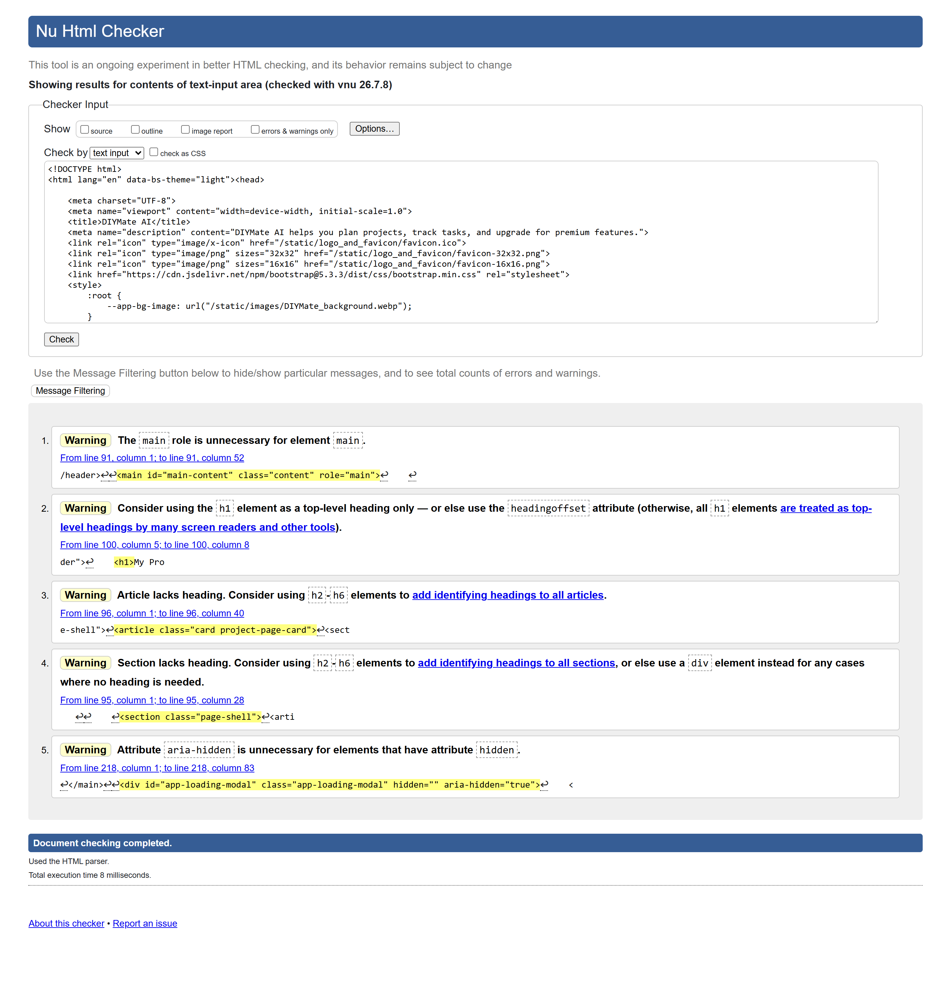
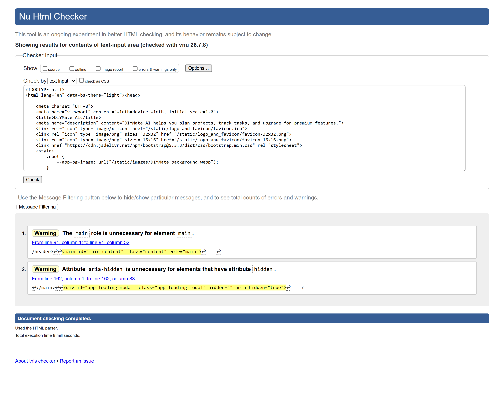
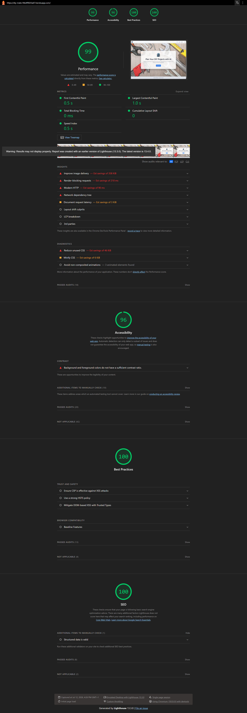
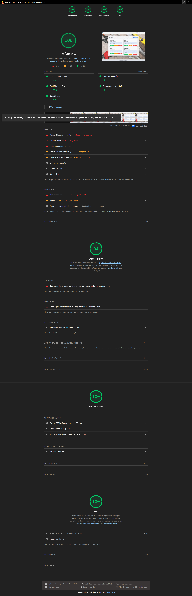
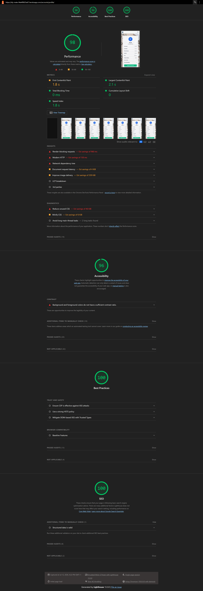
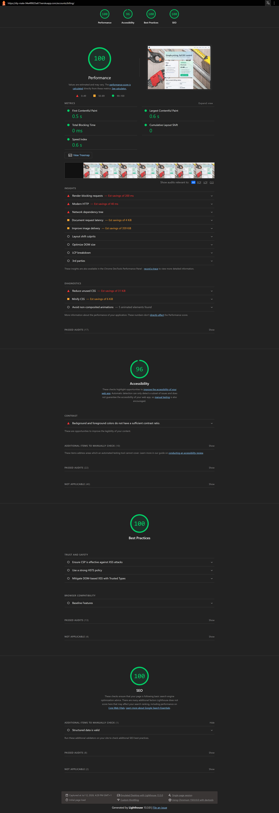
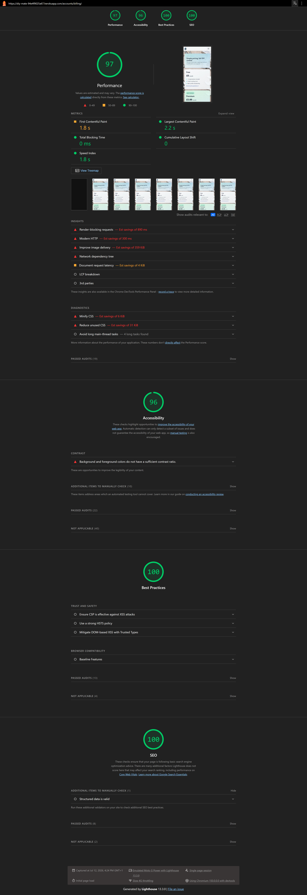
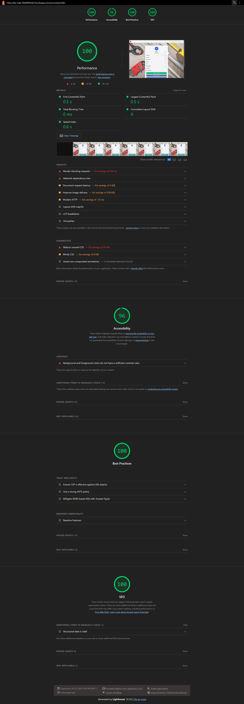

# VALIDATIONS

This file is for testing and validation evidence.

## Validation Screenshots

- HTML Validation:
    - Home page: 
    - Profile page: 
    - Projec page: 
    - Billing page: 

- CSS Validation: 

- Lighthouse Report: 
    - Home page desktp: 
    - Home page mobile: 
    - Project page desktp: 
    - Project page mobile: 
    - Billing page desktp: 
    - Billing page mobile: 
    - Profile page desktp: 
    - Profile page mobile: 

- Manual Testing Evidence: 

## Additional Notes

- TO DO