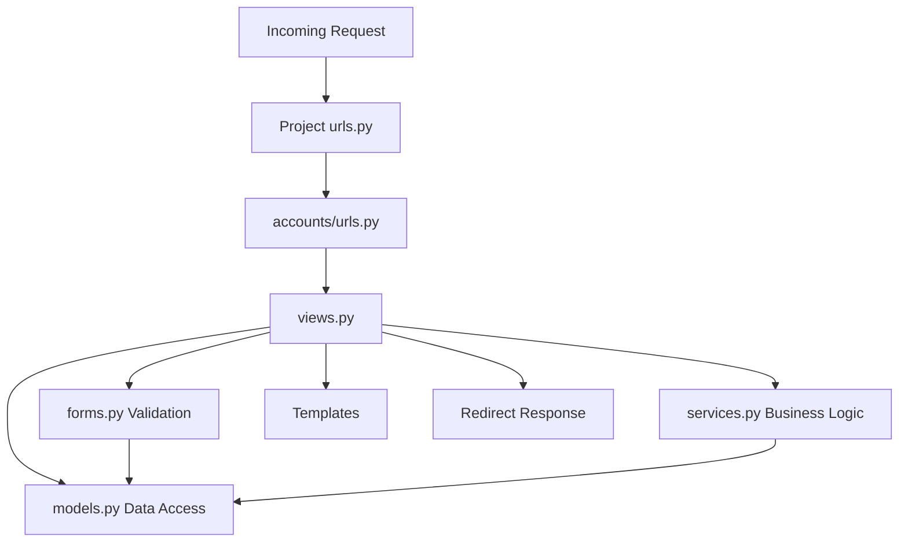
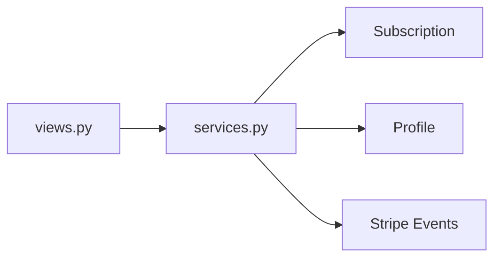
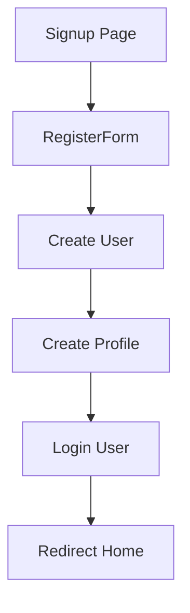
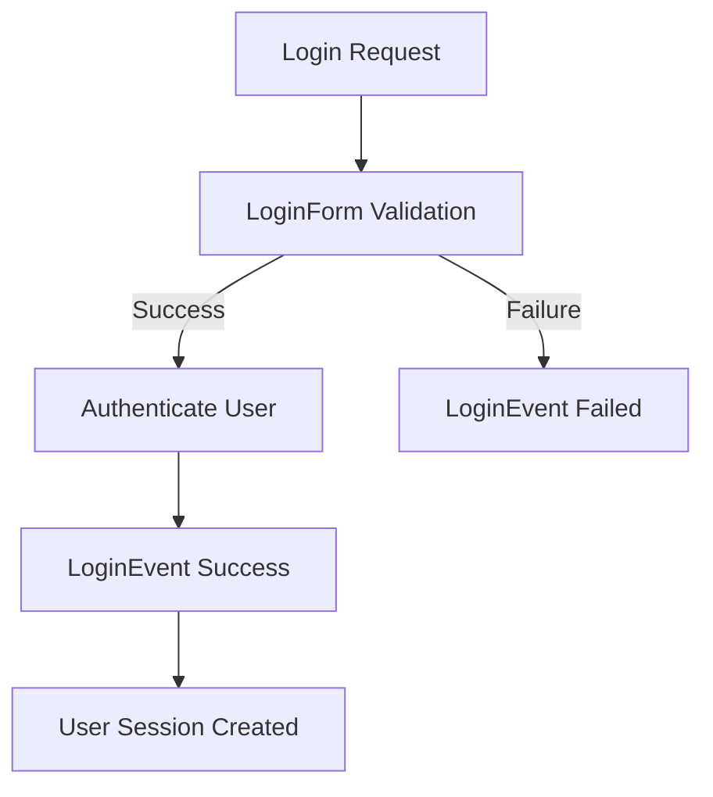
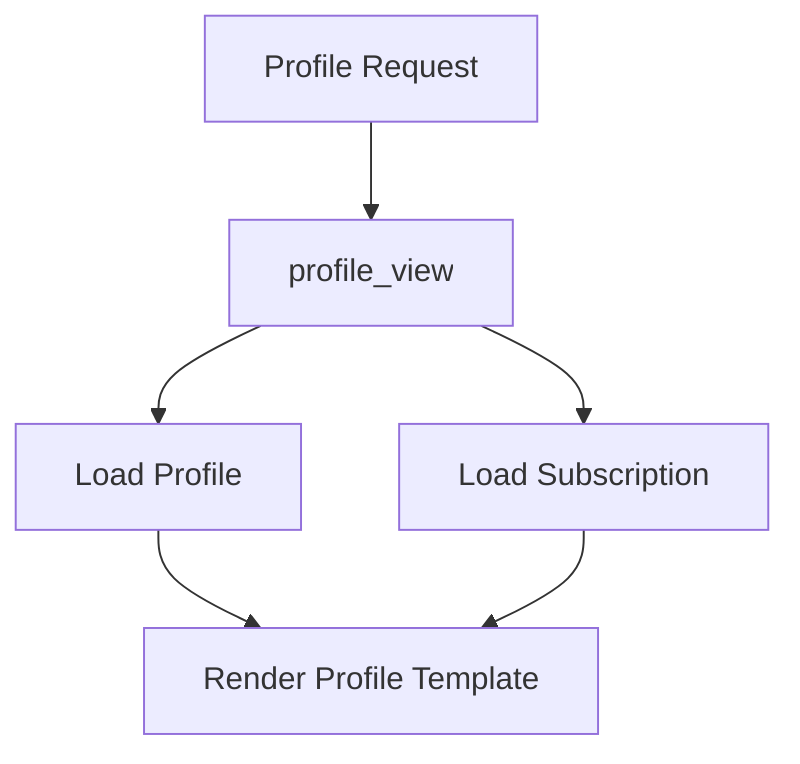
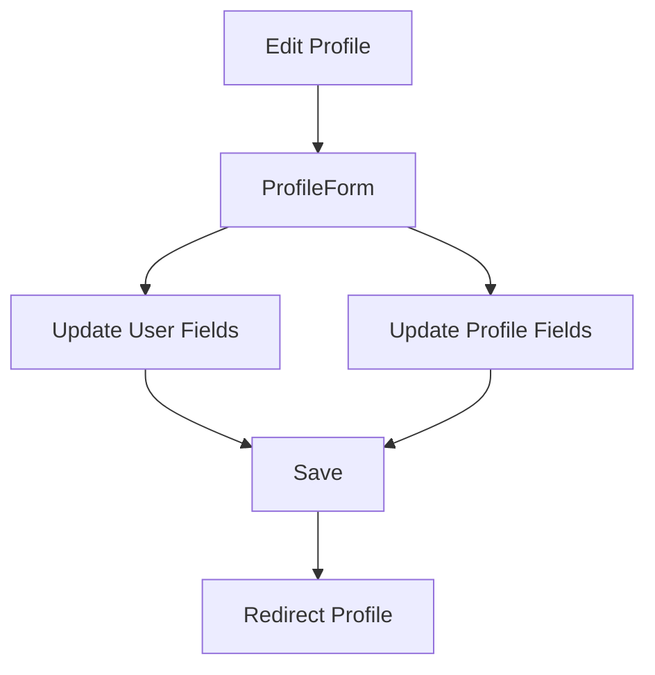
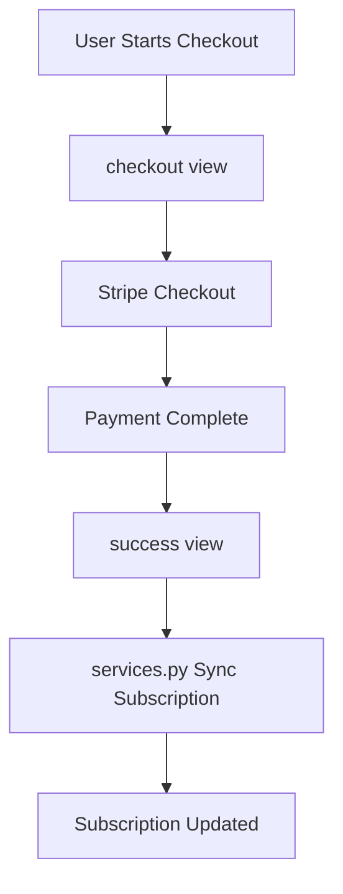
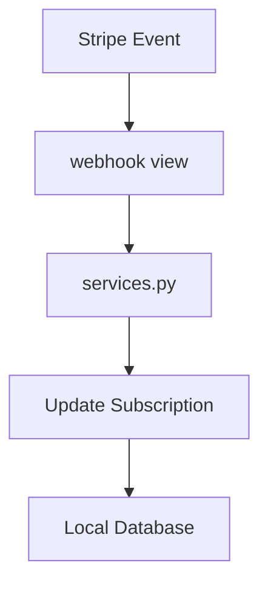
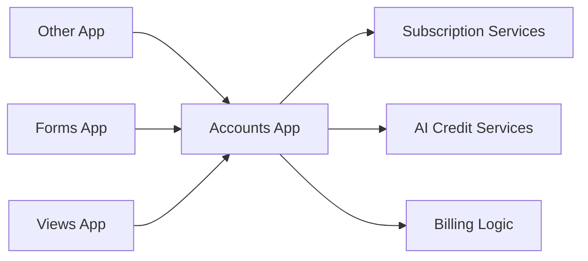
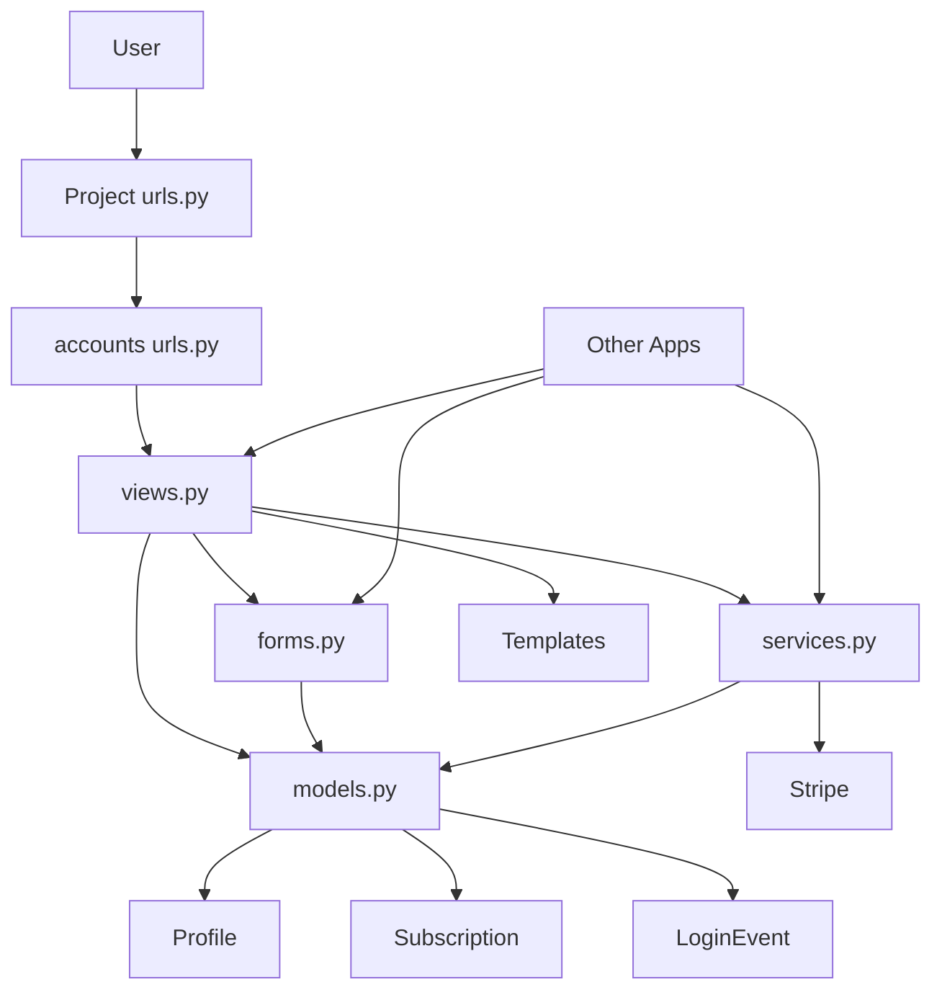

# Accounts App Architecture

## Overview

The `accounts` app is responsible for:

- User authentication (login/signup)
- User profile management
- Subscription and billing management
- Stripe integration
- AI usage limits and credit tracking
- Login audit logging

It acts as the **source of truth** for subscription status and AI usage gating across the project.

---

# High-Level Request Flow

---

# Layered Architecture

## 1. Entry Routing

### Project Routing

Project-level `urls.py` includes the accounts application routes.

### App Routing (`accounts/urls.py`)

Available endpoints:

- `login`
- `signup`
- `profile`
- `profile/edit`
- `billing`
- `checkout`
- `portal`
- `success`
- `cancel`
- `webhook`

---

## 2. Request Handling (Controller Layer)

All routes are mapped to view functions in `views.py`.

### Responsibilities

Views perform four primary tasks:

1. Read and validate user input using forms
2. Read and write model data
3. Call reusable business logic in `services.py`
4. Render templates or perform redirects

---

## 3. Form Layer

Forms are defined in `forms.py`.

### LoginForm

Used for authentication.

Responsibilities:

- Validate login credentials
- Provide cleaned authentication input

### RegisterForm

Used during user registration.

Responsibilities:

- Create Django `User`
- Create or update associated `Profile`

### ProfileForm

Used when editing account information.

Responsibilities:

- Update `Profile` fields
- Update linked Django `User` fields
- Persist both objects in a single save operation

---

## 4. Data Layer

Models are defined in `models.py`.

### Profile

One-to-one relationship with Django User.

Stores:

- Additional user information
- Profile-specific settings

### Subscription

One-to-one relationship with User.

Stores:

- Plan information
- Billing state
- Stripe identifiers
- Subscription metadata

### LoginEvent

Audit log model.

Stores:

- Successful login attempts
- Failed login attempts
- Security-related login history

### Admin Registration

Configured in `admin.py`.

Exposed models:

- Subscription
- LoginEvent

Admin features include:

- List views
- Search
- Filtering

---

## 5. Business Logic Layer

Reusable business logic lives in `services.py`.

### Subscription Services

#### Get or Create Subscription

Ensures a user always has a valid subscription record.

#### Free AI Limit Enforcement

Determines whether a user can access AI functionality.

#### AI Credit Consumption

Deducts usage credits after AI actions.

#### Stripe Synchronization

Converts Stripe subscription data into local subscription state.

#### Cancellation Handling

Updates local subscription records when a plan is cancelled.

### Design Principle

Views should call services instead of duplicating billing logic.

---

# Feature Flows

## Signup Flow

### Route

`accounts/signup/`

### Components

- Route: `urls.py`
- View: `signup_view`
- Form: `RegisterForm`

### Database Writes

- Django `User`
- `Profile`

### Result

1. User submits registration form
2. User record is created
3. Profile record is created
4. User is automatically logged in
5. Redirect to home page

---

## Login Flow

### Route

`accounts/login/`

### Components

- Route: `urls.py`
- View: `login_view`
- Form: `LoginForm`

### Side Effect

Creates a `LoginEvent` record for audit tracking.

---

## Profile Flow

### Routes

- `accounts/profile/`
- `accounts/profile/edit/`

### Components

Views:

- `profile_view`
- `edit_profile_view`

Uses:

- `Profile`
- `Subscription`
- `ProfileForm`
- Account templates

### Process

### Update Process

---

## Billing & Stripe Flow

### Routes

- `billing`
- `checkout`
- `portal`
- `success`
- `cancel`
- `webhook`

### Responsibilities

#### Checkout

Creates a Stripe Checkout Session.

#### Portal

Opens the Stripe Billing Portal.

#### Success

Receives completed checkout data and synchronizes the local subscription.

#### Webhook

Processes asynchronous Stripe events and updates local subscription records.

### Shared Logic

All Stripe-to-local synchronization is centralized in `services.py`.

### Webhook Processing

---

# Cross-App Dependency

The `accounts` application provides the central subscription and AI usage services used throughout the project.

Other applications consume functionality exposed by:

- `services.py`
- `forms.py`
- `views.py`

This makes `accounts` the **single source of truth** for:

- Subscription plans
- Billing status
- AI credit balances
- AI access restrictions
- Usage enforcement

---

# Complete Architecture Diagram

