# Planner App Architecture

## Overview

The `planner` app is responsible for:

- AI plan generation
- AI inspiration generation
- AI drawing generation
- AI drawing persistence
- AI usage-limit enforcement
- Premium feature enforcement

The app acts as the project's AI execution layer and works closely with:

- **Projects** (project ownership and storage target)
- **Accounts** (subscription and credit enforcement)
- **OpenAI** (text and image generation)

---

# High-Level Request Flow

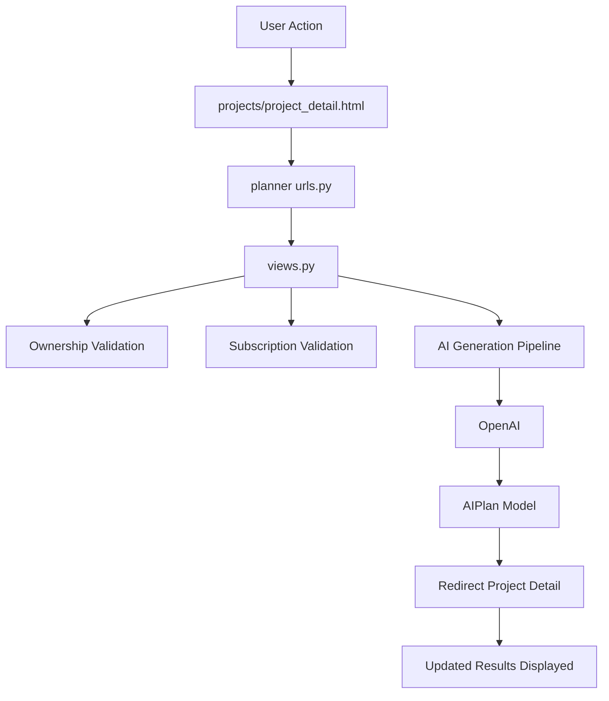

---

# Entry Routing

## Project URL Registration

The Planner application is mounted under:

```python
path("planner/", include("planner.urls"))
```

within the project's main routing configuration.

---

## Planner Routes (`urls.py`)

### Generate Plan

```text
generate/<project_id>/
```

Creates an AI plan for a project.

---

### Generate Inspirations

```text
generate/<project_id>/inspirations/
```

Creates AI-generated inspiration ideas.

---

### Generate Drawing Preview

```text
generate/<project_id>/drawing/regenerate/
```

Creates a temporary project drawing.

---

### Save Drawing

```text
generate/<project_id>/drawing/save/
```

Persists a temporary drawing permanently.

---

## Routing Diagram

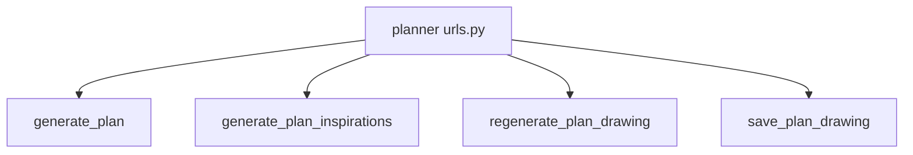

---

# Request Handling (Controller Layer)

All Planner routes are implemented as function-based views in `views.py`.

---

## Security

All handlers are protected with:

```python
@login_required
```

ensuring only authenticated users can access AI functionality.

---

## HTTP Enforcement

Every handler:

1. Requires POST requests
2. Rejects invalid methods
3. Redirects back to project detail on failure

---

## Ownership Validation

Users may interact only with projects they own.

Validation is performed using:

```python
get_object_or_404(
    Project,
    id=project_id,
    user=request.user
)
```

This prevents access to another user's project data.

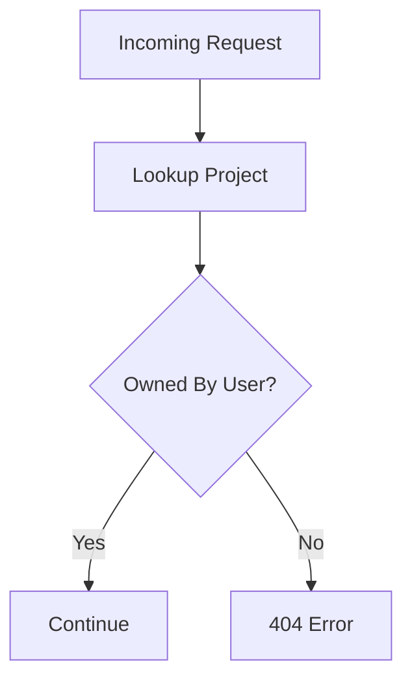

---

# Data Layer

## AIPlan Model

Planner stores all generated AI content inside:

```python
AIPlan
```

defined in `models.py`.

---

## Relationship

Each AI plan belongs to a Project.

```python
ForeignKey(
    Project,
    related_name="plans"
)
```

---

## Stored Data

### Plan Content

Stores structured project guidance:

- Materials
- Steps
- Cost estimates
- Safety considerations

---

### Inspirations

Stores generated inspiration data:

```python
generated_images
```

---

### Drawing Lifecycle

Temporary drawing fields:

```python
temporary_drawing_data
```

Permanent drawing fields:

```python
saved_drawing_data
```

Drawing save timestamp:

```python
drawing_saved_at
```

---

### Timestamps

```python
created_at
updated_at
```

---

## AIPlan Data Structure

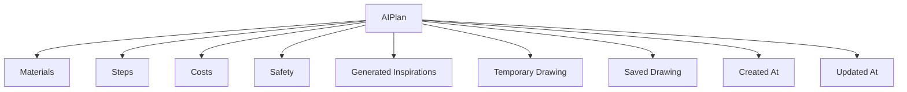

---

# AI Generation Pipeline

Prompt construction and response processing occur inside `views.py`.

---

## Prompt Builders

### Project Context

```python
build_project_context()
```

Builds normalized project information.

---

### Plan Prompt

```python
build_plan_prompt()
```

Creates the AI plan request.

---

### Inspiration Prompt

```python
build_inspiration_prompt()
```

Creates inspiration-generation requests.

---

### Drawing Prompt

```python
build_drawing_prompt()
```

Creates image-generation requests.

---

### Step Normalization

```python
normalize_steps()
```

Ensures generated steps conform to application limits.

---

# Text Generation Flow

Text generation is performed through OpenAI Chat Completions.

Function:

```python
generate_plan_text()
```

Process:

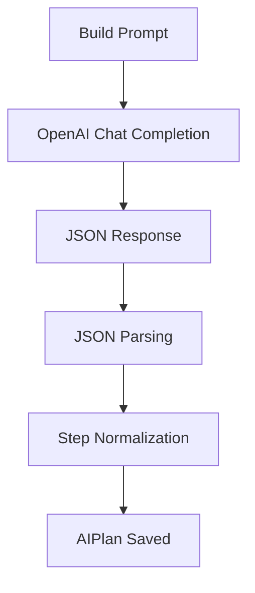

---

# JSON Processing

AI responses are cleaned and validated through:

```python
parse_ai_json_output()
```

Responsibilities:

- Parse structured AI output
- Remove malformed content
- Validate JSON structure
- Prepare data for persistence

---

# Image Generation Pipeline

Image generation logic is centralized in:

```python
openai_client.py
```

---

## Responsibilities

### Size Validation

Validates supported dimensions before generation.

---

### Image Generation

Calls:

```python
client.images.generate(...)
```

---

### Output Preference

Preferred output:

```text
Base64 Image Data
```

Fallback output:

```text
Remote Image URL
```

---

## Image Generation Flow

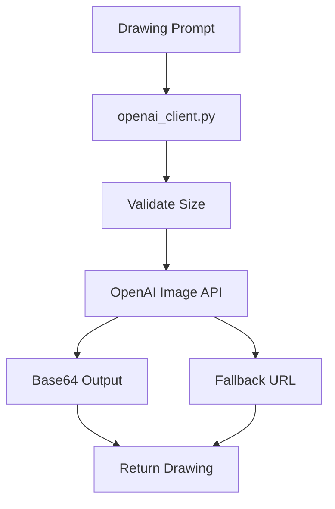

---

# Business Rules & Cross-App Dependencies

## Accounts Integration

Planner relies heavily on the Accounts service layer.

---

### Subscription Lookup

```python
get_or_create_subscription()
```

Used to determine user access level.

---

### AI Usage Credits

```python
consume_ai_generation_credit()
```

Used to limit free-tier AI generation.

---

### Premium Validation

Planner checks:

```python
Subscription.PLAN_PREMIUM
```

for premium-only functionality.

---

## Projects Integration

Planner operates on:

```python
Project
```

objects created by the Projects app.

Projects are the target entity receiving AI-generated content.

---

## Global AI Instructions

Application-wide AI behavior is centralized in:

```python
ai_instructions.py
```

Key constants include:

```python
AI_SYSTEM_INSTRUCTIONS
AI_USER_RULES
```

Current planner views primarily use:

```python
AI_SYSTEM_INSTRUCTIONS
```

---

# End-to-End Planner Flows

## Generate Plan Flow

### Route

```text
generate/<project_id>/
```

### Process

1. Validate POST request
2. Validate project ownership
3. Check for cached plan
4. Consume AI credits if required
5. Build prompt
6. Generate AI response
7. Parse JSON
8. Normalize steps
9. Create AIPlan
10. Redirect to project detail

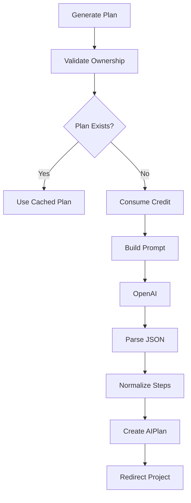

---

# Generate Inspirations Flow

## Route

```text
generate/<project_id>/inspirations/
```

### Rules

- Existing AIPlan required
- Cached inspirations reused when available

### Process

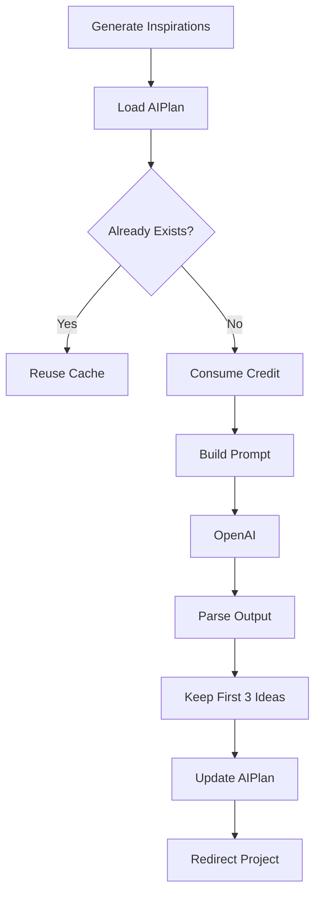

---

# Regenerate Drawing Flow

## Route

```text
generate/<project_id>/drawing/regenerate/
```

### Requirements

- Existing AIPlan
- Premium subscription
- One drawing per project limit

Validation helper:

```python
can_generate_project_drawing()
```

### Process

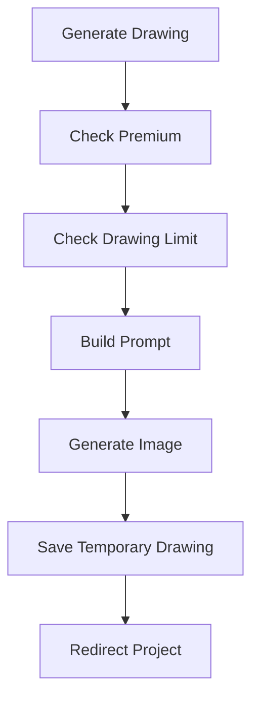

---

# Save Drawing Flow

## Route

```text
generate/<project_id>/drawing/save/
```

### Requirements

- AIPlan exists
- Temporary drawing exists

### Process

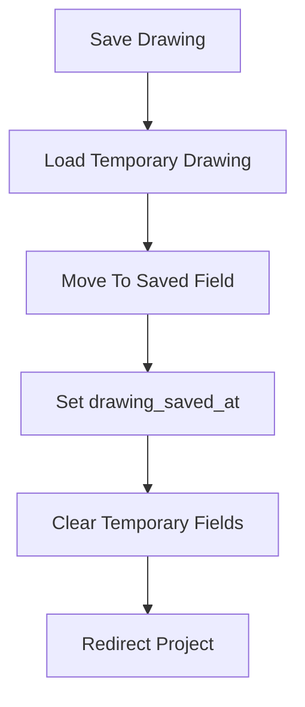

---

# Planner in the User Interface

The Planner app does not provide its own dedicated UI.

Instead, Planner actions originate from:

```text
project_detail.html
```

inside the Projects app.

---

## UI Relationship

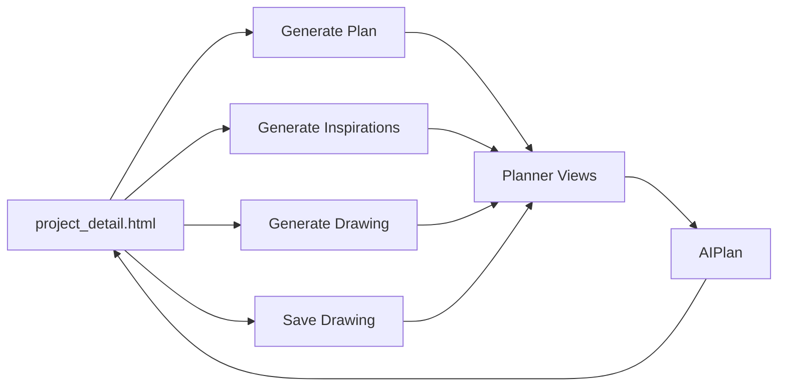

---

# Complete Cross-App Flow

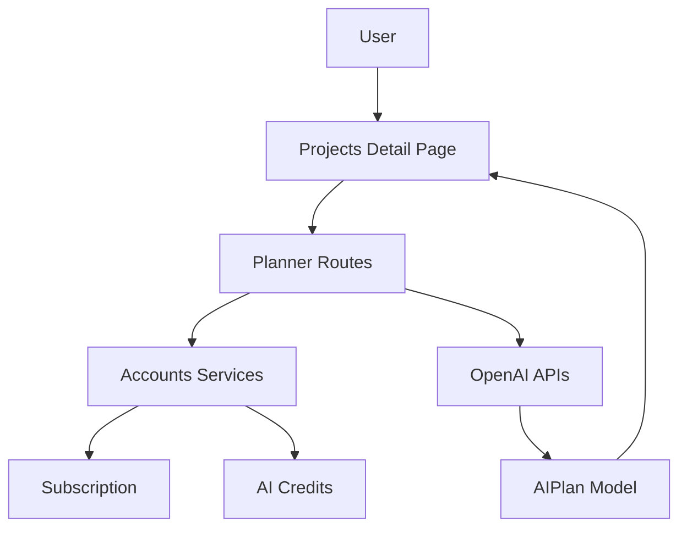

---

# Testing Status

## Current State

Planner currently has minimal direct testing.

File:

```text
planner/tests.py
```

contains primarily placeholder coverage.

---

## Actual Behavioral Coverage

Most Planner functionality is validated indirectly through Projects tests.

Covered scenarios include:

- AI plan generation flow
- Detail page rendering
- Premium feature gating
- Free-tier restrictions
- AI usage limits
- Inspiration generation
- Temporary drawing workflows
- Drawing save operations

---

## Testing Architecture

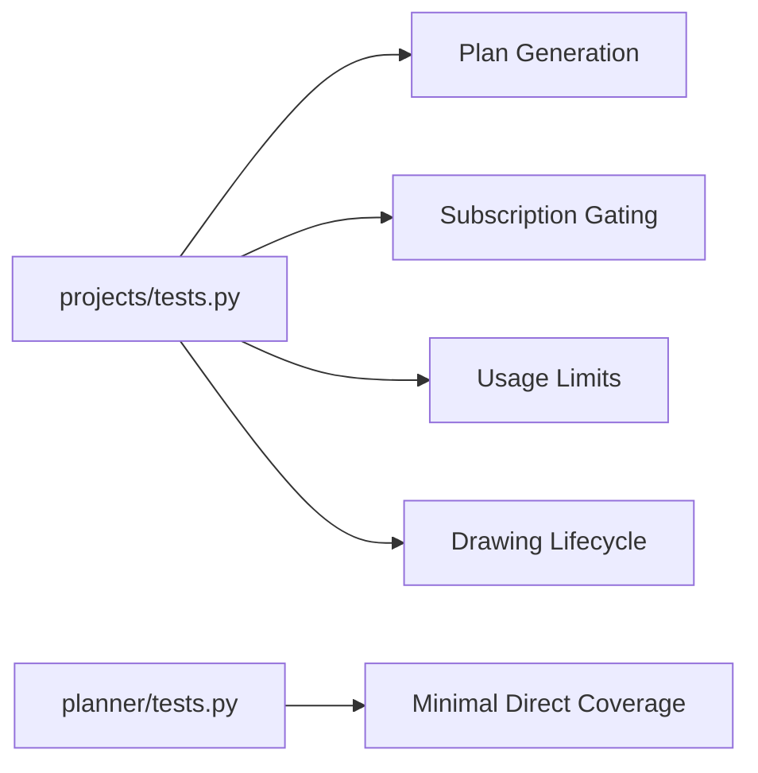

---

# Complete Architecture Diagram

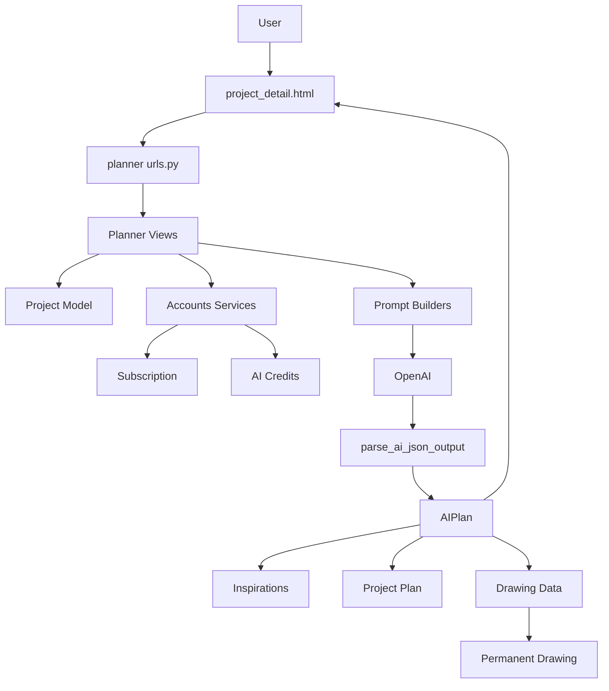