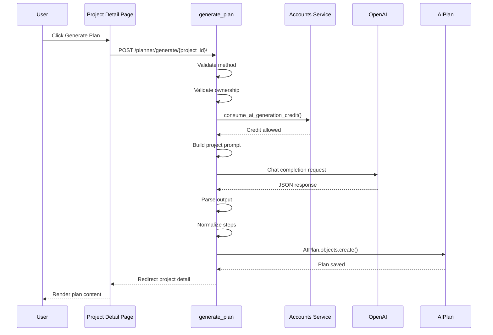
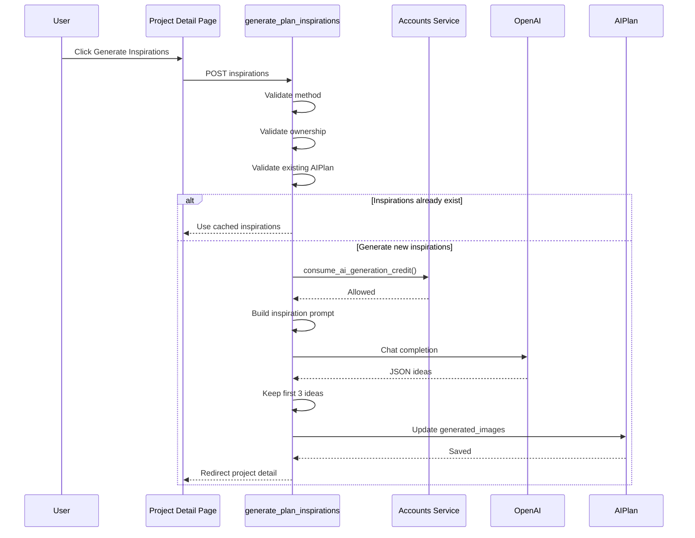
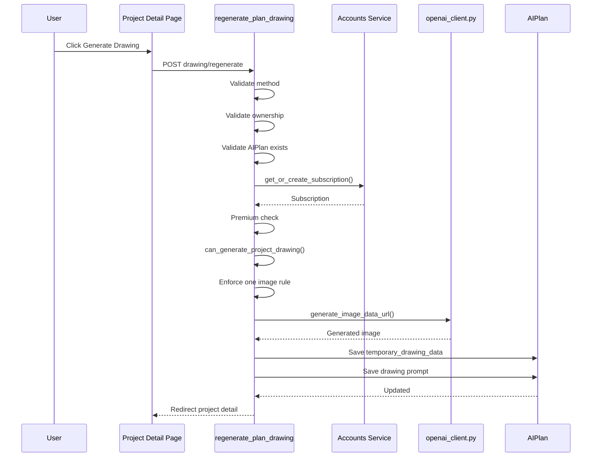
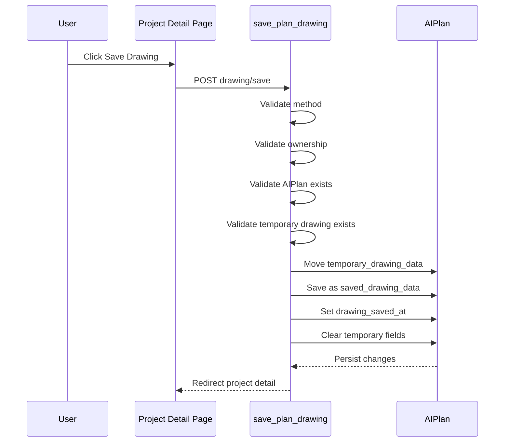
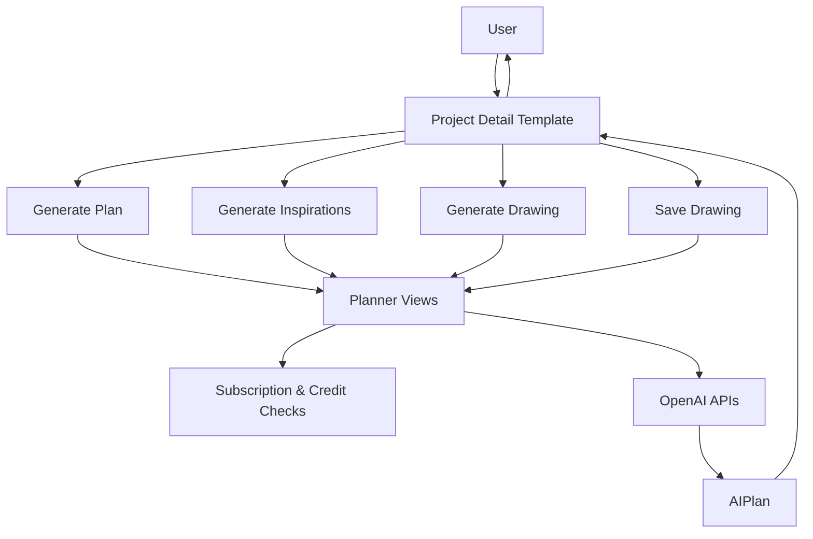

# Planner Endpoint Sequence Flows

## Overview

These sequence flows describe how each Planner endpoint processes requests from the user interface through validation, business rules, AI generation, persistence, and final rendering.

---

# 1. Generate Plan

### Route

```text
POST /planner/generate/{project_id}/
```

### Execution Path

```text
urls.py
    ↓
views.py
    ↓
accounts services
    ↓
OpenAI
    ↓
AIPlan model
    ↓
views.py redirect
```

### Sequence Diagram



### Flow Summary

1. Validate request method.
2. Validate project ownership.
3. Consume AI generation credit.
4. Build plan prompt from project data.
5. Request plan from OpenAI.
6. Parse and normalize output.
7. Create AIPlan record.
8. Redirect back to project detail.

---

# 2. Generate Inspirations

### Route

```text
POST /planner/generate/{project_id}/inspirations/
```

### Execution Path

```text
urls.py
    ↓
views.py
    ↓
accounts services
    ↓
OpenAI
    ↓
AIPlan model
```

### Sequence Diagram



### Flow Summary

1. Validate request.
2. Confirm project ownership.
3. Require existing AIPlan.
4. Use cached inspiration data if available.
5. Consume AI credit.
6. Generate inspiration ideas.
7. Save first three ideas.
8. Redirect to project detail.

---

# 3. Regenerate Drawing

### Route

```text
POST /planner/generate/{project_id}/drawing/regenerate/
```

### Execution Path

```text
urls.py
    ↓
views.py
    ↓
accounts services
    ↓
openai_client.py
    ↓
AIPlan model
```

### Sequence Diagram



### Flow Summary

1. Validate request and ownership.
2. Require existing AIPlan.
3. Check premium subscription.
4. Enforce one-image-per-project limit.
5. Generate image through OpenAI client.
6. Save temporary drawing data.
7. Redirect back to project detail.

---

# 4. Save Drawing

### Route

```text
POST /planner/generate/{project_id}/drawing/save/
```

### Execution Path

```text
urls.py
    ↓
views.py
    ↓
AIPlan model
```

### Sequence Diagram



### Flow Summary

1. Validate request.
2. Validate ownership.
3. Require existing AIPlan.
4. Require temporary drawing.
5. Move temporary drawing to permanent storage.
6. Set save timestamp.
7. Clear temporary fields.
8. Redirect to project detail.

---

# Unified Planner Flow



---

# One-Line Architecture Chain

```text
Projects UI (project_detail.html)
        ↓
Planner Endpoints
        ↓
Ownership Validation
        ↓
Accounts Subscription & Credit Enforcement
        ↓
OpenAI Generation
        ↓
AIPlan Persistence
        ↓
Redirect to Project Detail
        ↓
Updated AI Results Rendered
```