# Projects App Architecture

## Overview

The `projects` app is responsible for:

- Project CRUD operations
- Project ownership management
- Subscription-aware project features
- Displaying AI-generated planning content
- Acting as the central UX hub for AI planning workflows

The app does **not** generate AI content itself. Instead, it integrates closely with the **Planner** app for AI generation and with the **Accounts** app for subscription and usage enforcement.

---

# High-Level Request Flow

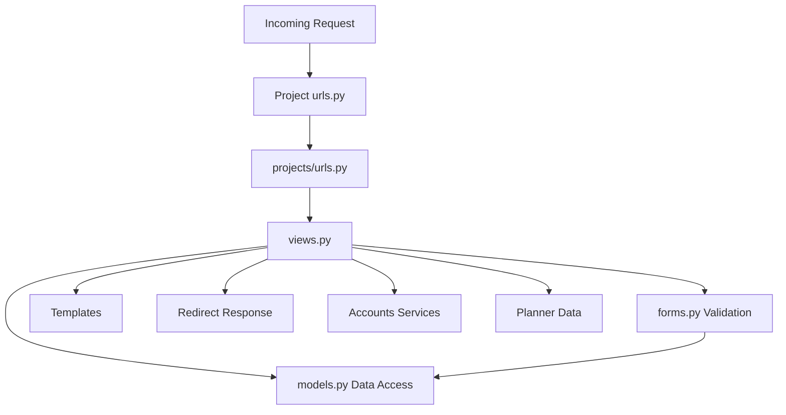

---

# Entry Routing

## Main Application Routing

The main application includes the Projects app routes:

```python
path('projects/', include('projects.urls'))
```

## App Routing (`projects/urls.py`)

### CRUD Routes

| Route | Purpose |
|---------|---------|
| `''` | Project list |
| `create/` | Create project |
| `<int:pk>/` | Project detail |
| `<int:pk>/edit/` | Edit project |
| `<int:pk>/delete/` | Delete project |

---

# Request Handling (Controller Layer)

All route handlers are function-based views in `views.py`.

### Security

Every view is protected by:

```python
@login_required
```

ensuring users only access their own project data.

---

# Core Controllers

## project_list

### Responsibility

Displays all projects owned by the current user.

### Actions

- Query user-owned projects
- Render project list template

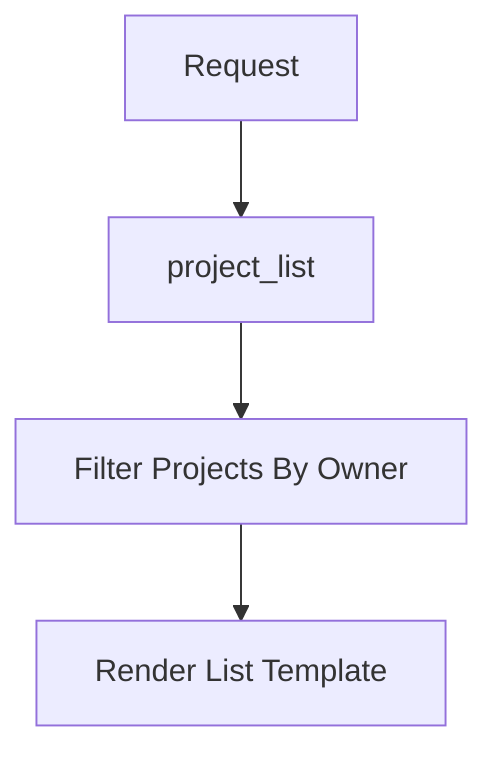

---

## create_project

### Responsibility

Creates a new project.

### Actions

- Validate `ProjectForm`
- Attach `request.user`
- Save project
- Redirect to project detail

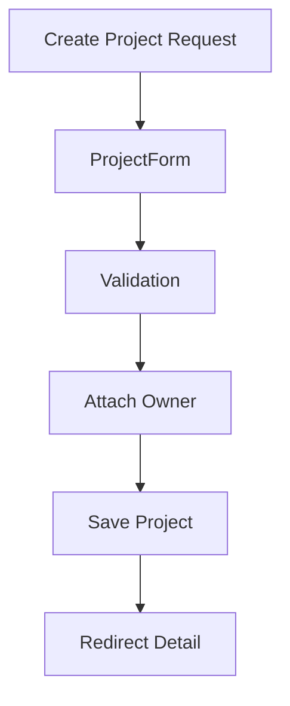

---

## project_detail

### Responsibility

Displays complete project information and latest AI-generated content.

### Actions

Loads:

- Project
- Latest AI plan
- Subscription context
- Previous/next navigation links

Also:

- Cleans up temporary drawings older than 2 hours

---

## edit_project

### Responsibility

Updates an existing project.

### Actions

- Load project
- Validate form
- Save changes
- Redirect to detail page

---

## delete_project

### Responsibility

Removes a project.

### Actions

- GET → confirmation page
- POST → delete record
- Redirect to projects list

---

# Form Layer

Forms are defined in `forms.py`.

## ProjectForm

Responsible for:

- Input validation
- Field rendering
- Subscription-aware behavior

### Subscription Integration

Form behavior depends on the user subscription.

It calls:

```python
get_or_create_subscription(user)
```

from the Accounts service layer.

### Premium Feature Gating

Non-premium users automatically have:

```text
image_url
```

removed from the form.

This means subscription restrictions are enforced during both rendering and validation.

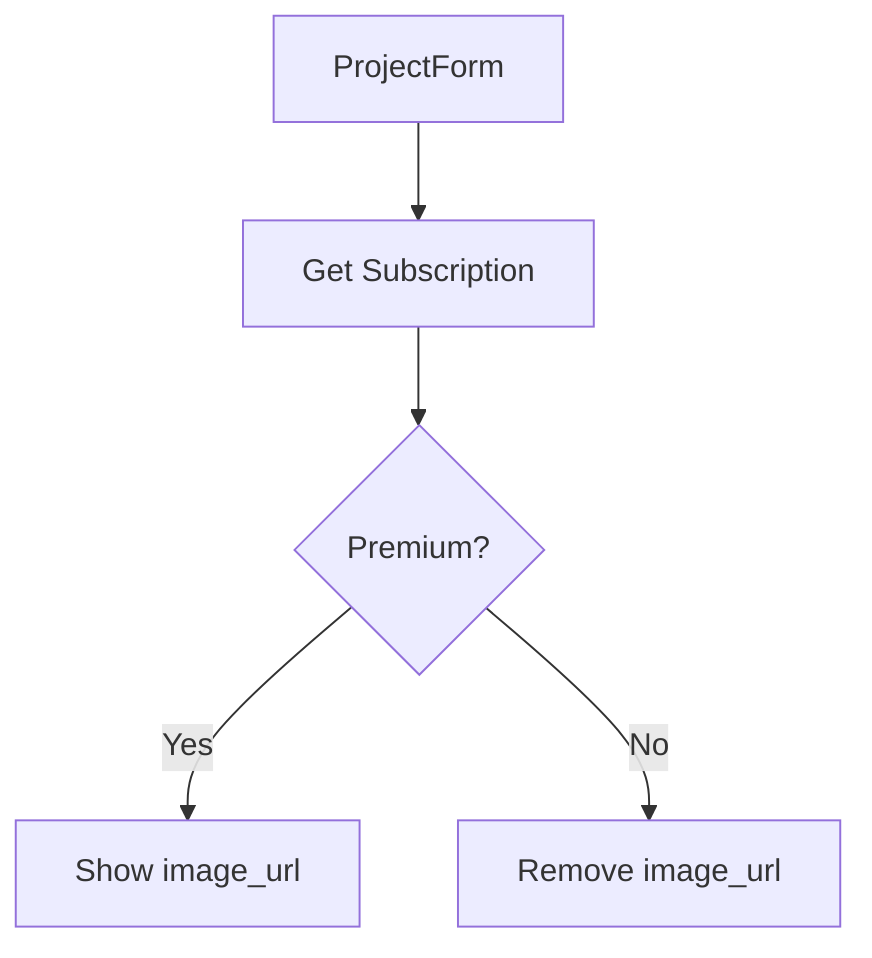

---

# Data Layer

## Project Model

Defined in `models.py`.

### Core Fields

- title
- description
- dimensions
- budget
- image_url (optional)
- created_at
- updated_at
- owner (ForeignKey to User)

### Ordering

Projects are ordered:

```text
Newest First
```

---

# Relationship With Planner

AI-generated content is not stored inside the Project model.

Instead it comes from:

```python
project.plans
```

using the Planner model relationship:

```python
related_name='plans'
```

### AI Data Access

Latest plan retrieval:

```python
project.plans.order_by('-created_at').first()
```

---

# Template/UI Layer

## Main Template

```text
project_detail.html
```

This page acts as the primary project workspace.

---

## Rendered Content

### Project Metadata

Displays:

- Title
- Description
- Dimensions
- Budget
- Image URL (if available)

### AI Plan Content

Displays:

- AI summary
- Step-by-step plan

### Inspirations

Displays:

- Inspiration suggestions
- Concept recommendations

### Drawings

Displays:

- Temporary drawings
- Saved drawings

### Project Actions

Provides buttons for:

- Generate Plan
- Generate Inspirations
- Generate Drawing
- Save Drawing
- Edit Project
- Delete Project

---

# Planner Integration

Most AI action buttons do not call Project views.

Instead they post directly to Planner routes.

### Planner Endpoints

- generate_plan
- generate_plan_inspirations
- regenerate_plan_drawing
- save_plan_drawing

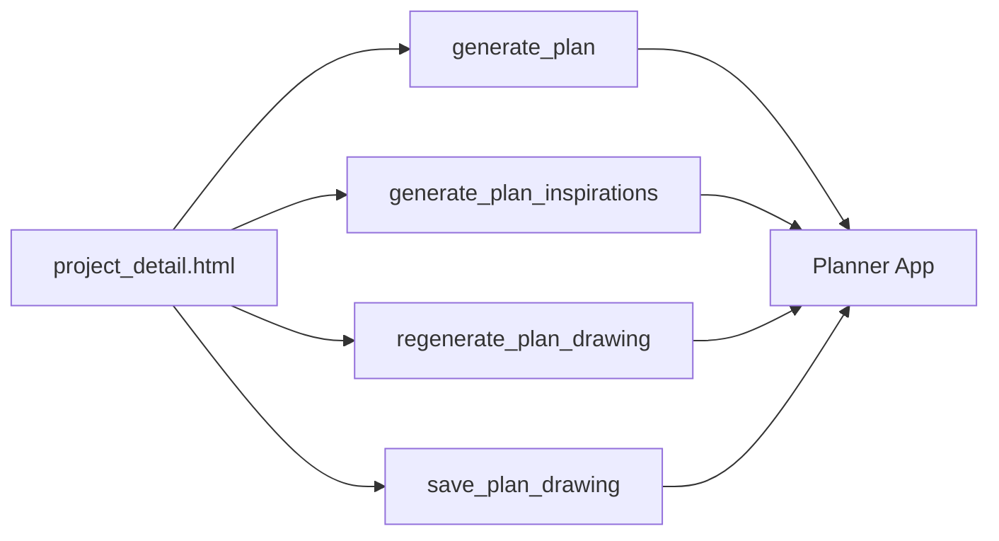

---

# Cross-App Dependencies

## Accounts Dependency

Projects depends on Accounts services for:

### Subscription Lookup

```python
get_or_create_subscription()
```

Used by:

- Forms
- Detail views
- Generation workflows

### Usage Credits

```python
consume_ai_generation_credit()
```

Used within Planner generation flows.

---

## Planner Dependency

Planner is responsible for:

- AI plan generation
- Inspiration generation
- Drawing generation
- AI content persistence

Projects simply display the resulting data.

---

# End-to-End Flows

## Create Project Flow

### Route

```text
projects/create/
```

### Process

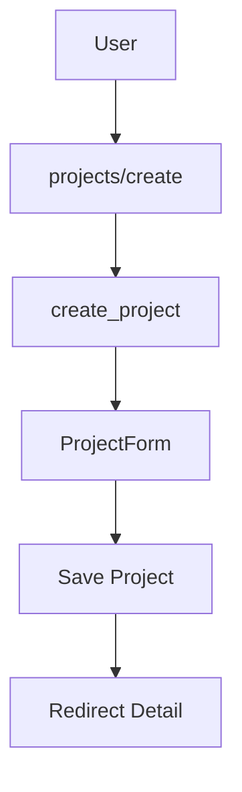

### Result

Creates a new Project and redirects to its detail page.

---

# View Project Detail + AI State

### Route

```text
projects/<pk>/
```

### Process

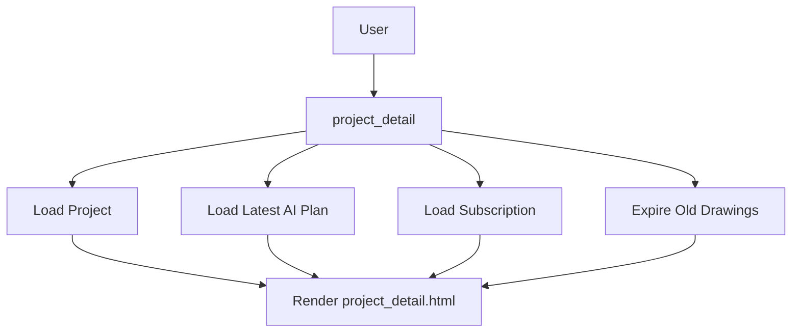

### Data Loaded

- User-owned project
- Latest AI plan
- Subscription information
- Drawing state

---

# Generate AI Content Flow

User actions start from:

```text
project_detail.html
```

### AI Actions

- Generate Plan
- Generate Inspirations
- Generate Drawing
- Save Drawing

### Processing

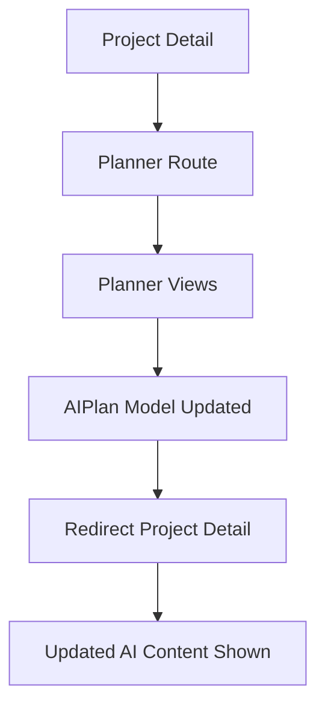

### Outcome

Updated AI content becomes visible when the user returns to the project detail page.

---

# Edit Project Flow

### Route

```text
projects/<pk>/edit/
```

### Process

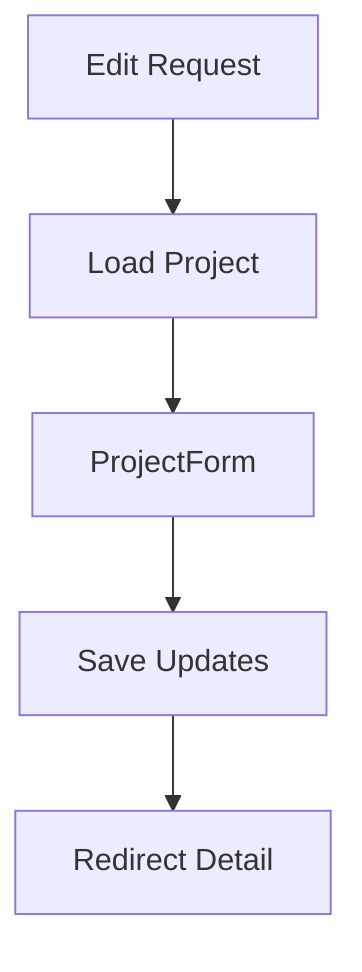

Only the Project entity is modified.

---

# Delete Project Flow

### Route

```text
projects/<pk>/delete/
```

### Process

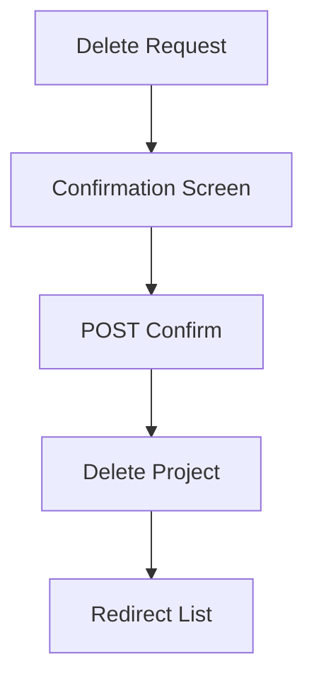

---

## Cascade Behavior

AI plans belong to projects through a foreign key.

Therefore:

```text
Delete Project
        ↓
Delete Related AI Plans
```

via database cascade rules.

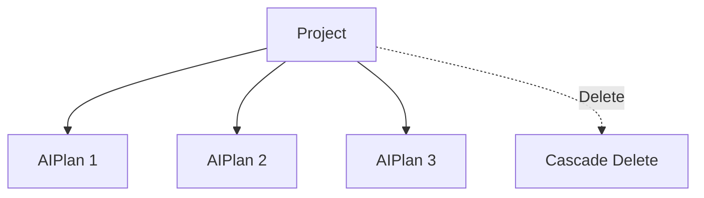

---

# Test Coverage Snapshot

Tests are implemented in:

```text
tests.py
```

## Covered Behaviors

### Project Creation

Verifies:

- Creating projects does not automatically generate AI plans

### Project Editing

Verifies:

- Updates only affect project data

### Detail Rendering

Verifies:

- AI plan content appears correctly on detail pages

### Subscription Gating

Verifies:

- Premium-only fields
- Premium-only functionality

### AI Usage Limits

Verifies:

- Free-tier limits
- Subscription-based access controls

### Drawing Workflows

Verifies:

- Temporary drawing creation
- Drawing persistence
- Temporary → saved drawing transition

---

# Complete Architecture Diagram

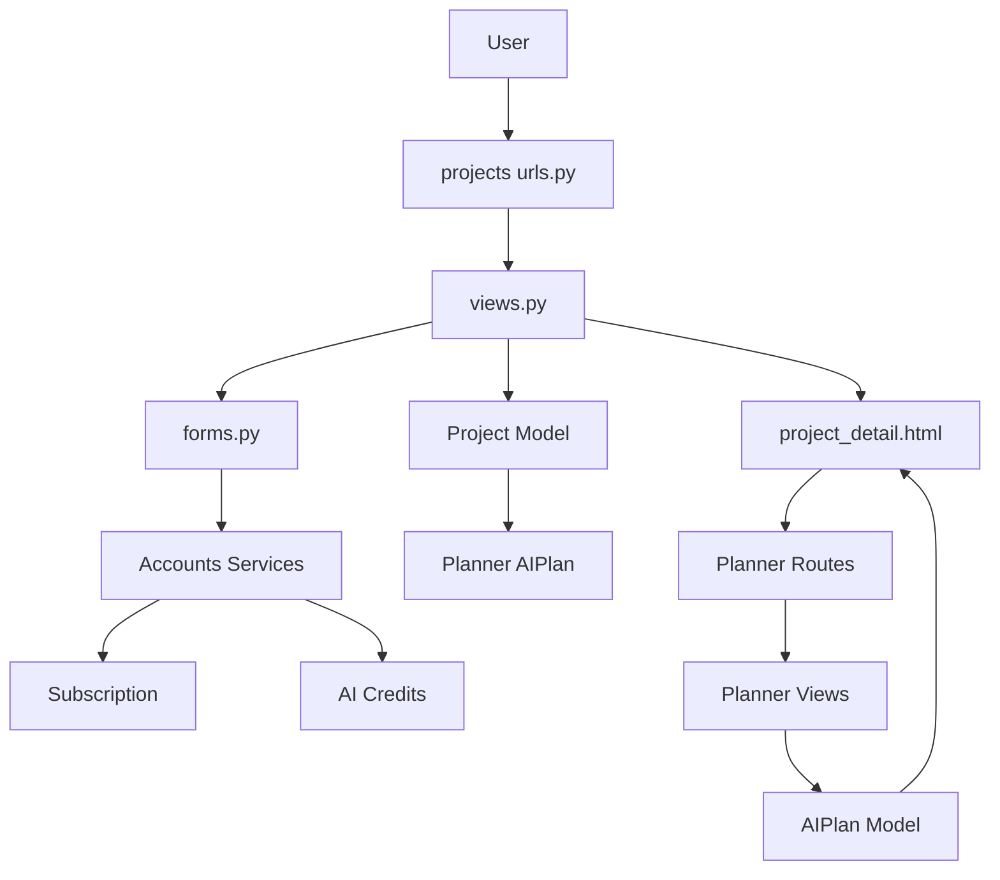